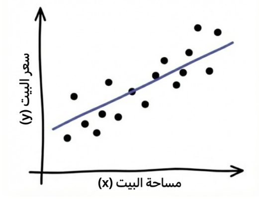
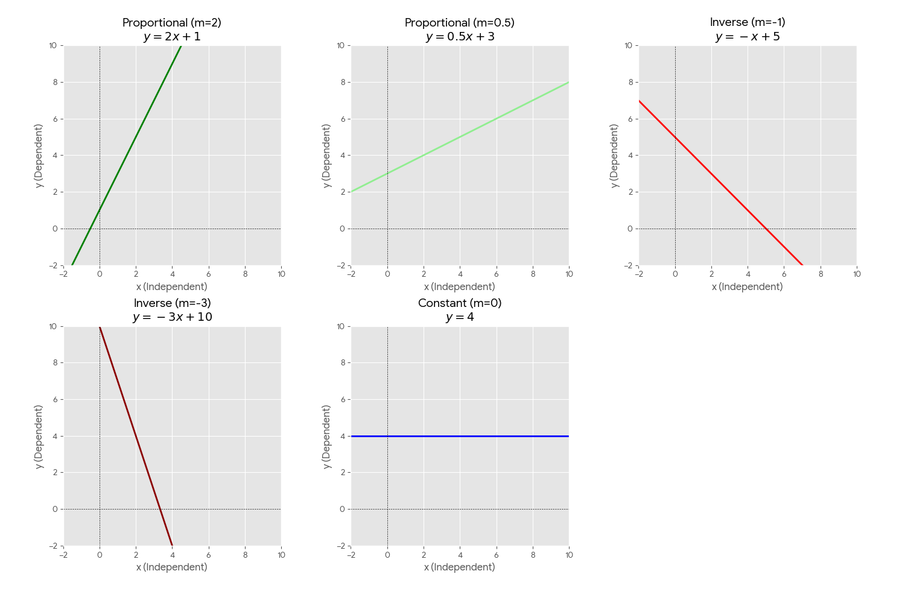

بسم الله الرحمن الرحيم.

نشرع في أول أقسام علم تعلم الآلة: **التعلم بالإشراف** (Supervised Learning) ويعني وجود إشارة التعليم التي تربط السبب بالنتيجة: من $x$ (المعطيات) إلى $y$ (المخرجات).

## المقادير المتصلة والمنفصلة في  المدخلات والمخرجات

والبيانات -سواءٌ معطيات أو مخرجات- تشمل كل معلومٍ جزئيٍّ من المقادير العددية المتصلة أو المنفصلة. وتختلف طريقة بناء نموذج التعلم ومعايرته باختلافها في المعطيات تارة، وفي المخرجات تارة أخرى.

فأما **المتصل** فالأعداد الممثلة لدرجة للحرارة والرطوبة أو سرعة الرياح أو ثقل الحجر أو أسعار السلع والقارات ونحوها.

يعبر عنها بأعداد الفاصلة العائمة (Floats):

* **موجب كبير:** $1,500,750.50$ (سعر أصل مالي).
* **سالب:** $-15.25$ (درجة التجمد).
* **صغير جداً:** $0.000007$ (تركيز كيميائي).

وأما **المنفصل** فقسمان:

الأول: **المرتب**. كالأرقام الدالة على المركز الأول والثاني، والصف الثالث والرابع، والدرجة الخامسة والسادسة، ونحو ذلك مما **لا يُشترط فيه تساوي المسافة بين قيَمِه** لكن كالعدد يُمكن المقارنة بين أجزائه.

يعبر عنها بالأعداد صحيحة (Integers) مثل:

* **رتب متسلسلة:** $1, 2, 3$ (الأول، الثاني، الثالث).
* **تقييم نسبي:** $-1, 0, 1$ (معارض، محايد، مؤيد).

الثاني: **غير مرتَّبٌ**. كالأرقام الدالة على والوجود والعدم للسمات مثل: الحمرة والصفرة، والتلف والسلامة في المصنوعات، والتعفن والنضج وعدمه في المطعومات، والحميد والخبيث في الأورام، ونحو ذلك مما هو **غير قابل للمقارنة؛ إذْ هو صفة**.

ويعبر عنها أيضًا بالأعداد الصحيحة (Integers) مثل:

* **ترميز ثنائي:** $0, 1$ (عدم، وجود) أو (سليم، مصاب).
* **فئات متعددة:** $101, 102, 103$ (ترميز للمدن أو فصائل الدم).

## التعلم من البيانات الموسومة

ونمثل على ذلك بمهمة بناء نموذج الهدف منه: **تقدير أسعار العقار**.

فأما العوامل المؤثرة في التقدير فتسمى **الخصائص** (Features). منها: المساحة، وعدد الأدوار، وعدد الغرف، والموقع، وما يجاوره، وكثير غيرها .. إلا أننا نقرِّبُ المثال بالنظر إلى عاملٍ واحد وهو: **المساحة**؛ ونحاوِلُ تقدير **سعر البيت**؛ ويسمى: **الهدف** (Target).

ثم ننظر في أعيان من البيوت وأسعارها؛ باعتبارها زوْجًا. وكل زوجٍ يسمى هنا **مشاهدة** (Observation)؛ فتُجمَعُ في جدوَل كهذا:


1. فأما المساحة (من الخصائص) فهي **المتغير المستقل** (Independent Variable)؛ ويرمز له عادة بالرمز: $x$
2. وأما السعر (من الهدف) **المتغير التابع** (Dependent Variable)؛ ويرمز له عادة بالرمز: $y$

ونحن في هذه التسمية نفترضُ أن العلاقة بين هذين المتغيرين (المساحة والسعر) السببُ فيها هو المساحة، والمسبَّبُ هو السعر. 

ثم تُنقَطُ في رسم يضع المتغير المستقل أفقيًّا ($x$)، والتابِعَ عموديًّا عليه ($y$)، فتمثل كل نقطة منها مشاهدة ($(x,y)$).

ثُمَّ تُخطُّ العلاقة بينهما بالنظر. **وهو النموذج (Model) الذي نسعى لخطِّه خوارزميًّا**، على نحو هذا الشكل:



## موضع التنبؤ

وإن ثقتنا في قدر التنبؤ الداخلية أعلى منها في الخارجية؛ لأننا في منطقة قريبة من مشاهدات التدريب. وكلما ابتعد التبنؤ عن بيانات التعلم زاد مورد الخطأ فيه:

- **داخلي (Interpolation)**: هو التنبؤ بقيمة $y$ لـ $x$ تقع **بين** أصغر وأكبر قيمة في بيانات التدريب.
- **خارجي (Extrapolation)**: هو التنبؤ بقيمة $y$ لـ $x$ تقع **خارج** حدود البيانات (أكبر من أقصى قيمة أو أصغر من أدنى قيمة).

## نموذج الانحدار الخطي (Linear Regression)

**الانحدار** (Regression) لغةً النزول، واصطلاحًا الرجوع. وسبب التسمية يعود لدراسة في الثمانينات من القرن التاسع عشر (Regression towards mediocrity in hereditary stature) حيث لاحظ فيها غالتون أن الأبناء من الآباء القصار والطوال يعودون إلى الطول الطبيعي.

ومعنى **الخطي** (Linear) لأن المستقيم يمثل علاقة ثابتة بين المتغير المستقل ($x$) والمتغير التابع ($y$) زيادةً ونقصانًا. وتظهر هذه العلاقة هندسياً **كخط مستقيم** (Line) في الفضاء ثنائي الأبعاد (2D)، أو كمستوى (Plane) في الأبعاد الثلاثية (3D)، أو كمستوى فائق (Hyperplane) في الأبعاد الأعلى (ND).

ومعادلة الخط المستقيم هي:

$$
y = mx+b
$$

فأما **المعاملات** (Parameters) فهي المتغيرات التي تشكل انحناء الخط ($m$) والنقطة ($b$) التي يقطع فيها المحور العمودي. فمثلاً:

فمثلاً: **النموذج (أ):** عند $m=2$ و $b=1$ تكون المعادلة $y = 2x + 1$. (خط مزاح للأعلى بمقدار وحدة واحدة، ويرتفع بمقدار وحدتين كلما اتجهنا أفقيًا في اتجاه الموجب).

وهذا يظهر بالحساب:

|  $x$ | ($2x + 1$)  |  $y$ |
| ---: | :---------- | ---: |
| $-2$ | $2(-2) + 1$ | $-3$ |
| $-1$ | $2(-1) + 1$ | $-1$ |
|  $0$ | $2(0) + 1$  |  $1$ |
|  $1$ | $2(1) + 1$  |  $3$ |
|  $2$ | $2(2) + 1$  |  $5$ |

ويمكن أن نخط هذا النموذج:


ننشئ مجموعة خطوط مستقيمة للتدرب على المعادلة لنتعرف عليها عن قُرب:

| **نوع العلاقة**    | $b$  | $m$   | **التوصيف**                                          |
| ------------------ | ---- | ----- | ---------------------------------------------------- |
| **طردية (مثال 1)** | $1$  | $2$   | زيادة واضحة: كلما زاد $x$ زاد $y$ بمقدار الضعف.      |
| **طردية (مثال 2)** | $3$  | $0.5$ | زيادة طفيفة: $y$ ينمو ببطء مع زيادة $x$.             |
| **عكسية (مثال 1)** | $5$  | $-1$  | تناقص متساوٍ: كلما زاد $x$ نقص $y$ بنفس المقدار.     |
| **عكسية (مثال 2)** | $10$ | $-3$  | تناقص حاد: هبوط سريع في قيمة $y$ مع كل زيادة في $x$. |
| **لا علاقة**       | $4$  | $0$   | حيث: $y = b$ (خط أفقي)، $y$ لا يتأثر بتغير $x$.      |

الشكل التالي يبين جميع هذه الخطوط المستقيمة:



ملاحظة: تتعدد الرموز في المراجع العلمية لوصف نفس الدالة الخطية، ومن أشهرها:

1.  الصيغة العامة:
$$f(x) = ax + b$$
2. صيغة الفرضية الشائعة في الأبحاث:
$$h_{\theta}(x) = \theta_0 + \theta_1 x$$
3. الصيغة الشائعة في الإحصاء:
$$y = \beta_0 + \beta_1 x$$
4. صيغة الأوزان الشائعة في الشبكات العصبية الاصطناعية (التعلم العميق):
$$f(x;w) = w_1 x + w_0$$ 
وكلها ترمز إلى نفس الأمر: معادلة خط مستقيم.

وقد يتم تعريف ناتج الدالة بتحريك الحرف $y$ ليكون هكذا:
$$
\hat{y} = f(x;w)
$$

- ونقرؤها هكذا: إن التقدير $\hat{y}$ ناتج عن عمل الدالة النموذج $f$ على الخصائص $x$ المضبوط وِفق المعاملات $w$.
- فأما الناتج $\hat{y}$ (بتحريك الحرف $y$) فلتمييز النتيجة التقديرية $\hat{y}$ عن الحقيقية في البيانات $y$ .. (وذلك لأننا سنقارن بين ما يتوقعه النموذج وبين الحقيقة، لتقييم قدرته التنبؤية).

## كيفية تدريب نموذج انحدار خطي في بايثون

نستعمل حزمة `sklearn` المتضمنة لأدوات تعلم الآلة، ومن ذلك نموذج `LinearRegression` من وحدة النماذج الخطية `sklearn.linear_model` ثم نعرف البيانات كمصفوفة من حزمة `numpy` ذات الكفاءة العالية في الحساب المصفوفات (Matrices) والمتجهات (Vertices) الرياضية:

```python
from sklearn.linear_model import LinearRegression
import numpy as np
```

- البيانات `X` و `y`

```python
X = np.array([[1], [2], [3], [4]]) # المدخلات
y = np.array([2, 4, 6, 8])        # المخرجات
```

- لنفترض أن العوامل الصحيحة هي $y=2x$ (الآلة لا تعرف هذه القاعدة، بل تتعلمها)؛ لكننا نعرف أن النمط خطي

```python
model = LinearRegression()
```

- عملية الاستقراء (التعلم)

```python
model.fit(X, y)
```

ملاحظة: في حزمة `sklearn` تخزن العوامل بعد عملية التدريب على البيانات في نموذج الانحدار الخطي `LinearRegression` في الخاصيتين:
- الميل $b$ باسم: `coef_`
- التقاطع $m$ باسم: `intercept_

والآن:

- التنبؤ بحالة جديدة بناءً على العلاقة المستقرأة

```python
new_case = np.array([[5]])
prediction = model.predict(new_case)

print(f"التنبؤ للقيمة 5 هو: {prediction[0]}") # النتيجة ستكون 10 تقريباً
```

حسنًا، ماذا لو كانت العلاقة متغيرة؟ هل نستيط استعمال النموذج الخطي فيها؟

## العلاقات اللاخطية

**العلاقة اللاخطية** (Non-linear Relationship) هي العلاقة التي لا يكون فيها التغير في المتغير التابع ($y$) متناسباً طردياً أو عكسياً بشكل ثابت مع التغير في المتغير المستقل ($x$). بعبارة أخرى، إذا قمت بتمثيلها بيانياً، فلن تحصل على خط مستقيم، بل على منحنى.

في العلاقة الخطية، يكون الاشتقاق (Derivative) -أي: الميل- ثابتاً دائماً. أما في العلاقة اللاخطية، فإن الميل يتغير عند كل نقطة.

- **المعادلة الخطية:** $y = mx + b$ (الميل $m$ ثابت).
- **المعادلة اللاخطية:** قد تحتوي على أسس، لوغاريتمات، أو دوال مثلثية، مثل:    
    - التربيعية: $y = ax^2 + bx + c$        
    - الأسية: $y = ab^x$

وفيما يلي أسماء لهذه العلاقات وأمثلة لتحققها في الظواهر الطبيعية.

### 1. العلاقة التربيعية (Quadratic Relationship)

تأخذ هذه العلاقة غالباً شكل حرف **"U" مقلوب**. ومن الأمثلة الشائعة عليها العلاقة بين **ساعات العمل في الأسبوع مقابل الإنتاجية**؛ حيث تزداد الإنتاجية حتى نقطة معينة، ثم تبدأ في الانخفاض نتيجة للإجهاد.


كذلك:
- **طاقة الجسم المتحرك وسرعته:** تزداد الطاقة الحركية بمربع السرعة ($K.E = \frac{1}{2}mv^2$).
- **مساحة المربع وطول الضلع:** المساحة تزيد تربيعيًا بالنسبة للضلع ($Area = s^2$).    
- **مساحة الدائرة ونصف القطر:** تتبع علاقة تربيعية ($Area = \pi r^2$).    


### 2. العلاقة التكعيبية (Cubic Relationship)

تتميز العلاقة التكعيبية بشكل حرف **"S"** وبوجود منحنيين أو انعطافين متمايزين. تظهر هذه الأنماط بشكل متكرر في:

- **حجم البالون ونصف القطر:** العلاقة بين حجم الكرة ونصف قطرها تكعيبية ($V = \frac{4}{3}\pi r^3$).
- **الديناميكا الحرارية:** تظهر هذه العلاقة بكثرة بين المتغيرات الفيزيائية في هذا المجال.    


## نمذجة العلاقة اللاخطية

```python
from sklearn.preprocessing import PolynomialFeatures
from sklearn.linear_model import LinearRegression
```

أولاً: **`PolynomialFeatures(degree=2)`**: تحويل الميزة $x$ إلى ميزات إضافية تشمل المربع ($x^2$) والتفاعل بين الميزات. رياضياً، يحول المعادلة من خطية $y = wx + b$ إلى منحنى من الدرجة الثانية: $$y = w_0 + w_1x + w_2x^2$$
```python
poly = PolynomialFeatures(degree=2)
X_poly = poly.fit_transform(X)
```

ثانيًا: **`LinearRegression()`**: خوارزمية الانحدار الخطي العادية التي ستتعلم الأوزان ($w$) بناءً على الميزات الجديدة الناتجة.

```python
model = LinearRegression()
model.fit(X_poly, y)
```
