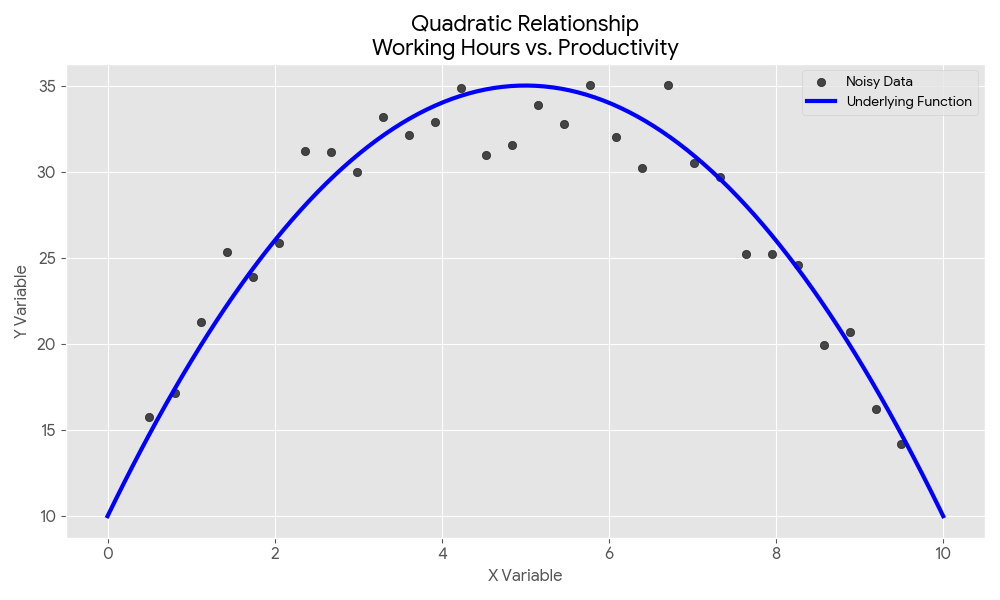
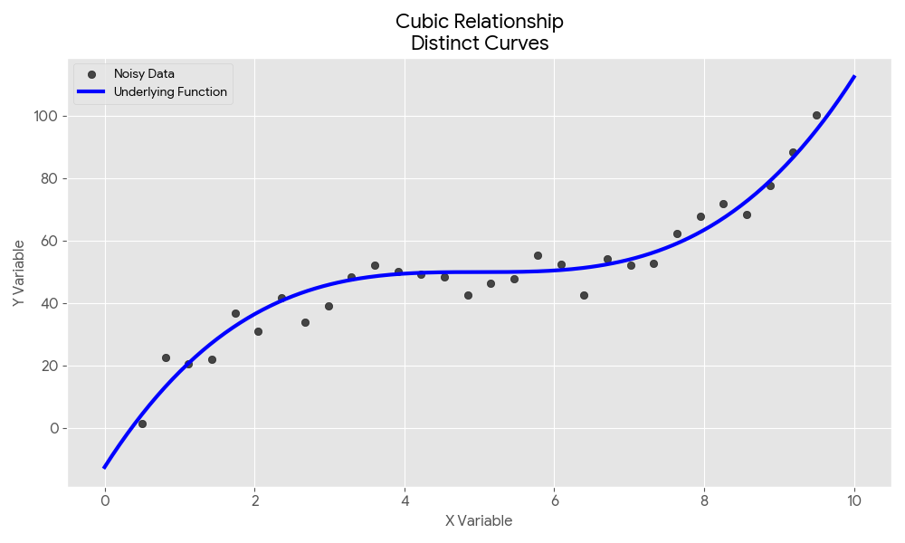
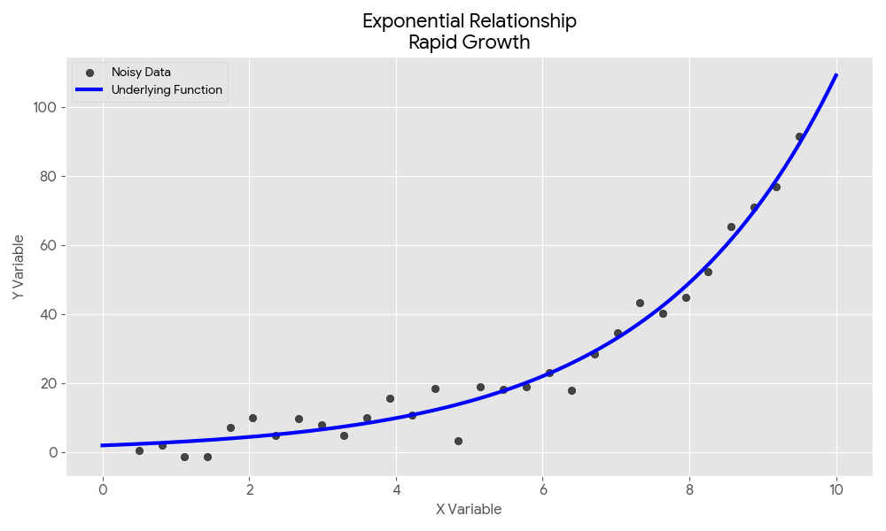
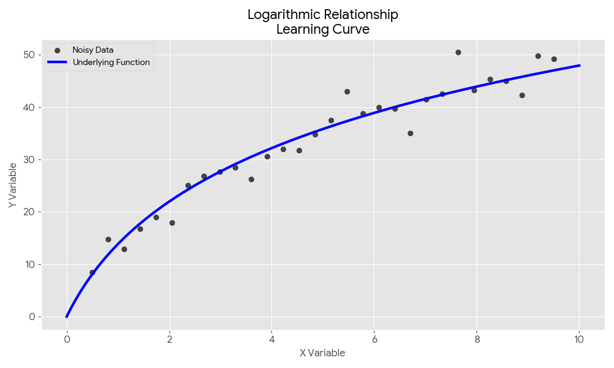

بسم الله الرحمن الرحيم.


## العلاقات اللاخطية (Non-linear Relationships)

**العلاقة اللاخطية** (Non-linear Relationship) هي العلاقة التي لا يكون فيها التغير في المتغير التابع ($y$) متناسباً طردياً أو عكسياً بشكل ثابت مع التغير في المتغير المستقل ($x$). بعبارة أخرى، إذا قمت بتمثيلها بيانياً، فلن تحصل على خط مستقيم، بل على منحنى.

في العلاقة الخطية، يكون الاشتقاق (Derivative) -أي: الميل- ثابتاً دائماً. أما في العلاقة اللاخطية، فإن الميل يتغير عند كل نقطة.

- **المعادلة الخطية:** $y = mx + b$ (الميل $m$ ثابت).
- **المعادلة اللاخطية:** قد تحتوي على أسس، لوغاريتمات، أو دوال مثلثية، مثل:    
    - التربيعية: $y = ax^2 + bx + c$        
    - الأسية: $y = ab^x$

وفيما يلي أسماء لهذه العلاقات وأمثلة لتحققها في الظواهر الطبيعية.

## 1. العلاقة التربيعية (Quadratic Relationship)

تأخذ هذه العلاقة غالباً شكل حرف **"U" مقلوب**. ومن الأمثلة الشائعة عليها العلاقة بين **ساعات العمل في الأسبوع مقابل الإنتاجية**؛ حيث تزداد الإنتاجية حتى نقطة معينة، ثم تبدأ في الانخفاض نتيجة للإجهاد.


كذلك:

- **طاقة الجسم المتحرك وسرعته:** تزداد الطاقة الحركية بمربع السرعة ($K.E = \frac{1}{2}mv^2$).
- **مساحة المربع وطول الضلع:** المساحة تزيد تربيعيًا بالنسبة للضلع ($Area = s^2$).    
- **مساحة الدائرة ونصف القطر:** تتبع علاقة تربيعية ($Area = \pi r^2$).    


## 2. العلاقة التكعيبية (Cubic Relationship)

تتميز العلاقة التكعيبية بشكل حرف **"S"** وبوجود منحنيين أو انعطافين متمايزين. تظهر هذه الأنماط بشكل متكرر في:

- **حجم البالون ونصف القطر:** العلاقة بين حجم الكرة ونصف قطرها تكعيبية ($V = \frac{4}{3}\pi r^3$).
- **الديناميكا الحرارية:** تظهر هذه العلاقة بكثرة بين المتغيرات الفيزيائية في هذا المجال.    




## كيفية التعامل مع العلاقات اللاخطية في بايثون

```python
from sklearn.preprocessing import PolynomialFeatures
from sklearn.linear_model import LinearRegression
```

أولاً: **`PolynomialFeatures(degree=2)`**: تحويل الميزة $x$ إلى ميزات إضافية تشمل المربع ($x^2$) والتفاعل بين الميزات. رياضياً، يحول المعادلة من خطية $y = wx + b$ إلى منحنى من الدرجة الثانية: $$y = w_0 + w_1x + w_2x^2$$
```python
poly = PolynomialFeatures(degree=2)
X_poly = poly.fit_transform(X)
```

ثانيًا: **`LinearRegression()`**: خوارزمية الانحدار الخطي العادية التي ستتعلم الأوزان ($w$) بناءً على الميزات الجديدة الناتجة.

```python
model = LinearRegression()
model.fit(X_poly, y)
```

## 3. العلاقة الأسية (Exponential Relationship)

في العلاقة الأسية، ينمو المتغير التابع بمعدل يتزايد بسرعة فائقة. ونرى ذلك بوضوح في **النمو السكاني** أو في **الانفجار السريع لطول نبات الخيزران** بعد مرحلة أولية من النمو البطيء.



## 4. العلاقة اللوغاريتمية (Logarithmic Relationship)

هي العلاقة التي تشهد نمواً هائلاً في البداية، ثم يتباطأ هذا النمو بشكل كبير مع مرور الوقت أو زيادة المدخلات، فيما يُعرف بمبدأ **تناقص العائدات** (Diminishing Returns).

- مثلاً: في الفيزياء، استجابة أذن الإنسان لشدة الصوت ليست خطية بل لوغاريتمية. إذا ضاعفت كمية الطاقة الصوتية، فلن تشعر بأن الصوت أصبح ضِعف العلو، بل تشعر بزيادة بسيطة فقط.



راجع: [التحويلات اللاخطية](https://scikit-learn.org/stable/modules/preprocessing.html#non-linear-transformation)