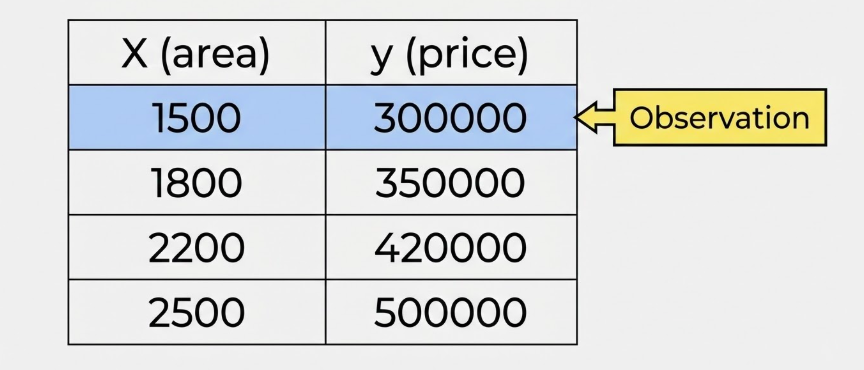
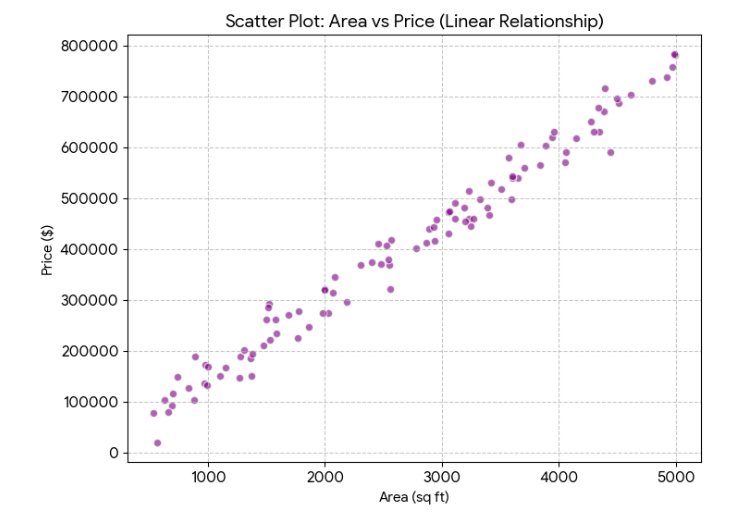
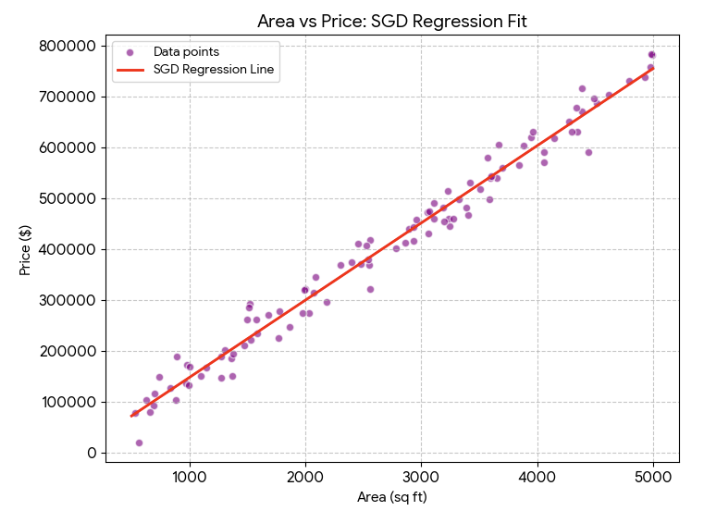
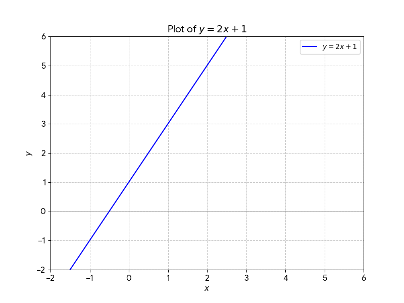
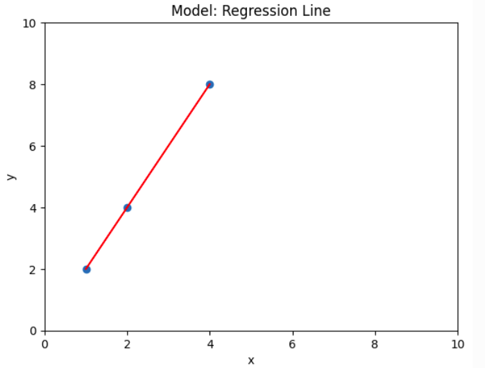
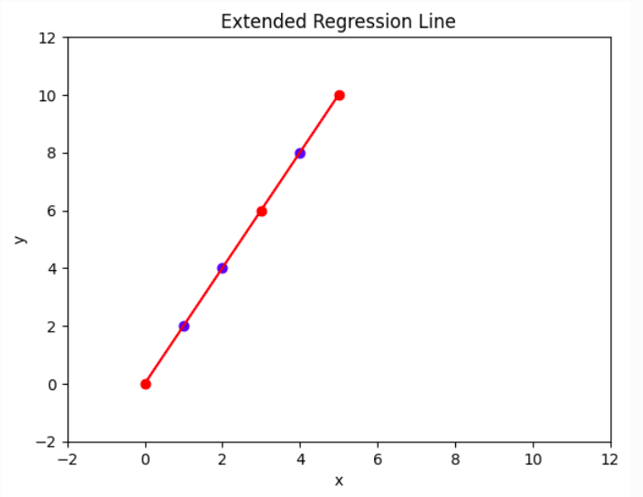
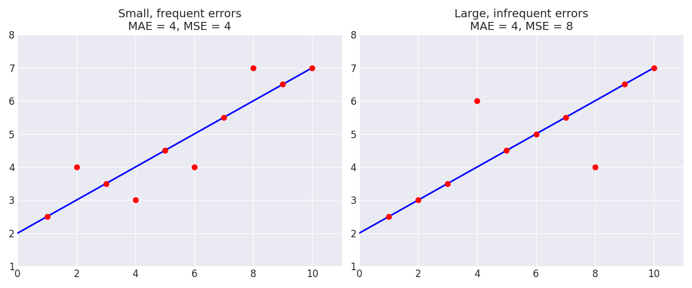

بسم الله الرحمن الرحيم.

نشرع في أول أقسام علم تعلم الآلة: **التعلم بالإشراف** (Supervised Learning) ويعني وجود إشارة التعليم التي تربط السبب بالنتيجة: من $x$ (المعطيات) إلى $y$ (النتائج).

مثال ذلك:

| المجال | المجهول | المعطيات |
| ---: | ---: | ---: |
| العقارات | سعر العقار | المساحة، عدد الغرف، عدد الأدوار، الموقع |
| التسويق | العائد | الإنفاق في الإعلانات |
| التصنيع | العمر الافتراضي | الرطوبة، الحرارة، الضغط |

## مثال: العقار

فأما العوامل المؤثرة في التقدير فتسمى **الخصائص** (Features). منها، في مثال تقدير سعر البيت: المساحة، وعدد الأدوار، وعدد الغرف، ونحو ذلك .. إلا أننا نقرِّبُ المثال بالنظر إلى عاملٍ واحد وهو: **المساحة**. وتسمى **المتغيرات المستقلة** (Independent Variables). ويرمز لها عادة بالرمز: $x$ في المفرد أو $X$ في الجمع.

ونحاوِلُ تقدير **سعر البيت**؛ ويسمى: **الهدف** (Target). ويسمى **المتغير التابع** (Dependent Variable). ويرمز له عادة بالرمز: $y$ في المفرد أو $Y$ في الجمع.

ثم ننظر في أعيان من البيوت وأسعارها؛ باعتبارها زوْجًا. وكل زوجٍ يسمى هنا **مشاهدة** (Observation)؛ فتُجمَعُ في جدوَل كهذا:



ثم تُنقَطُ في رسم يضع المتغير المستقل أفقيًّا ($x$)، والتابِعَ عموديًّا عليه ($y$)، فتمثل كل نقطة منها مشاهدة $(x,y)$.



ثُمَّ تُخطُّ العلاقة بينهما بالنظر. **وهو النموذج (Model) الذي نسعى لخطِّه خوارزميًّا**، على نحو هذا الشكل:



ثم لا نحتاج للنقاط؛ إذْ صار لدينا النموذج:


## المقادير المتصلة والمنفصلة

والبيانات -سواءٌ معطيات أو مخرجات- تشمل المقادير العددية المتصلة أو المنفصلة. ومعرفة ذلك ضرورية لأمور:

1. اختيار المعالجة المناسبة.
2. اختيار خوارزمية التعلم المناسبة.
3. اختيار مقياس الأداء المناسب.

.. وغير ذلك.

### المقادير المتصلة

فأما **المتصل** (Continuous) فالأعداد الممثلة لدرجة للحرارة والرطوبة أو سرعة الرياح أو ثقل الحجر أو أسعار السلع والقارات ونحوها.

يعبر عنها بأعداد الفاصلة العائمة (Floats):

* **موجب كبير:** $1,500,750.50$ (سعر أصل مالي).
* **سالب:** $-15.25$ (درجة التجمد).
* **صغير جداً:** $0.000007$ (تركيز كيميائي).

### المقادير المنفصلة

وأما **المنفصل** (Discrete) فقسمان:

الأول: **المرتب** (Ordinal). كالأرقام الدالة على المركز الأول والثاني والثالث؛ والفرق بينها وبين المتصل هو **أن المسافة بين أجزائه غير متساوية**؛ فما بين الأول والثاني لا كما بين الثاني والثالث. وبهذا الاعتبار تكون منفصلة. لكنها تقبل المقارنة؛ فالأول قبل الثاني، والثالث بعدهما.

يعبر عنها بالأعداد صحيحة (Integers) مثل:

* **رتب متسلسلة:** $1, 2, 3$ (صغير، وسط، كبير).
* **تقييم نسبي:** $-1, 0, 1$ (معارض، محايد، مؤيد).

الثاني: **غير مرتَّبٌ** (Nominal) **فلا يقبل  المقارنة**؛ كصفة الليونة والخشونة؛ إذْ لا معنى للمسافة بينهما ولا الترتيب. فيتم ترميزها بأرقام تدل على والوجود (1) والعدم (0). مثل: الحمرة والصفرة، والتلف والسلامة في المصنوعات، والتعفن والنضج وعدمه في المطعومات، والحميد والخبيث في الأورام.

ويعبر عنها أيضًا بالأعداد الصحيحة (Integers) مثل:

* **ترميز ثنائي:** $0, 1$ (عدم، وجود) أو (سليم، مصاب).
* **فئات متعددة:** $1, 2, 3$ (ترميز للمدن أو فصائل الدم).


## اختيار خوارزمية التعلم المناسبة

وينقسم التعلم الإشرافي بحسب نوع إشارة التعلُّم. ولا يؤثر كوْن الخصائص نفسها ($X$) متصلة أو منفصلة على نوع الخوارزمية، وإنما الذي يؤثر فيها هو نوع المتغير التابع: $y$.

فأما **الانحدار (Regression)**: يهدف إلى توقع قيمة متصلة (مثل سعر البيت). وله خوارزميات تعلم خاصة به مثل: `LinearRegression` و `SGDRegressor`. وهو موضوعنا الآن.

وأما **التصنيف (Classification)**: يهدف إلى توقع فئة أو تصنيف (مثل اسم الحيوان). وله خوارزميات تعلم خاصة به مثل: `KNNClassifier` و `LogisticRegression`. ويأتي بيانه في حينه.


## نموذج الانحدار الخطي (Linear Regression)

### مصطلح الانحدار

مناقشة مصطلح **الانحدار** (Regression).

يعود لقصة تاريخية مرتبطة بعالم الإحصاء **فرانسيس غالتون (Francis Galton)** في القرن التاسع عشر. 

لغةً النزول، واصطلاحًا الرجوع. وسبب التسمية يعود لدراسة في الثمانينات من القرن التاسع عشر (Regression towards mediocrity in hereditary stature) حيث لاحظ أن الآباء طويلي القامة بشكل مفرط يميل أبناؤهم لأن يكونوا أقصر منهم (أقرب إلى متوسط طول البشر)، والآباء قصار القامة بشكل مفرط يميل أبناؤهم لأن يكونوا أطول منهم (أيضاً أقرب إلى المتوسط). فبدلاً من أن يستمر الطول في الزيادة اللانهائية جيلاً بعد جيل، "تنحدر" القيم المتطرفة وتعود للاستقرار حول المركز.

### الخطي

**الخطي** (Linear): لأن المستقيم يمثل علاقة ثابتة بين المتغير المستقل ($x$) والمتغير التابع ($y$) زيادةً ونقصانًا. وتظهر هذه العلاقة هندسياً **كخط مستقيم** (Line) في الفضاء ثنائي الأبعاد (2D).

ومعادلة الخط المستقيم هي:

$$
y = mx+b
$$

فأما **المعاملات** (Parameters) فهي المتغيرات التي تشكل انحناء الخط ($m$) والنقطة ($b$) التي يقطع فيها المحور العمودي. فمثلاً:

فمثلاً: $m=2$ و $b=1$ تكون المعادلة $y = 2x + 1$. (خط مزاح للأعلى بمقدار وحدة واحدة، ويرتفع بمقدار وحدتين كلما اتجهنا أفقيًا في اتجاه الموجب).

ويمكن أن نخط هذا النموذج ([ولك أن تجرب في ديسموس](https://www.desmos.com/calculator)) أو هنا مباشرة:

<div dir="ltr">

```{ojs}
//| echo: false
//| panel: sidebar
viewof m = Inputs.range([-10, 10], {value: 1, step: 0.1, label: "Slope (m)"})
viewof b = Inputs.range([-10, 10], {value: 0, step: 0.1, label: "Intercept (b)"})

html`<b>Current Equation:</b> $y = ${m.toFixed(1)}x + ${b.toFixed(1)}$`
```

</div>

<div dir="ltr">

```{ojs}
//| echo: false
Plot.plot({
  grid: true,
  x: { domain: [-10, 10], label: "x" },
  y: { domain: [-10, 10], label: "y" },
  marks: [
    // The Line: defined by the function y = mx + b
    Plot.ruleY([0], {strokeOpacity: 0.2}),
    Plot.ruleX([0], {strokeOpacity: 0.2}),
    Plot.line(d3.range(-10, 11, 0.1), {
      x: d => d,
      y: d => m * d + b,
      stroke: "steelblue",
      strokeWidth: 2
    })
  ]
})
```

</div>



ننشئ مجموعة خطوط مستقيمة للتدرب على المعادلة لنتعرف عليها عن قُرب:

| **نوع العلاقة**    | $b$  | $m$   | **التوصيف**                                          |
| ------------------ | ---- | ----- | ---------------------------------------------------- |
| **طردية (مثال 1)** | $1$  | $2$   | زيادة واضحة: كلما زاد $x$ زاد $y$ بمقدار الضعف.      |
| **طردية (مثال 2)** | $3$  | $0.5$ | زيادة طفيفة: $y$ ينمو ببطء مع زيادة $x$.             |
| **عكسية (مثال 1)** | $5$  | $-1$  | تناقص متساوٍ: كلما زاد $x$ نقص $y$ بنفس المقدار.     |
| **عكسية (مثال 2)** | $10$ | $-3$  | تناقص حاد: هبوط سريع في قيمة $y$ مع كل زيادة في $x$. |
| **لا علاقة**       | $4$  | $0$   | حيث: $y = b$ (خط أفقي)، $y$ لا يتأثر بتغير $x$.      |

الشكل التالي يبين جميع هذه الخطوط المستقيمة:


### تعدد أشكال المعادلة

ملاحظة: تتعدد الرموز في المراجع العلمية لوصف نفس الدالة الخطية، ومن أشهرها:

1.  الصيغة العامة:
$$y = ax + b$$
2. صيغة الفرضية الشائعة في الأبحاث (الحرف اللاتيني: ثيتا):
$$h_{\theta}(x) = \theta_0 + \theta_1 x$$
3. الصيغة الشائعة في الإحصاء (الحرف اللاتيني: بيتا):
$$y = \beta_0 + \beta_1 x$$
4. صيغة الأوزان (Weights) الشائعة في الشبكات العصبية الاصطناعية (التعلم العميق):
$$f(x;w) = w_1 x + w_0$$ 
وكلها ترمز إلى نفس الأمر: معادلة خط مستقيم.

وقد يتم تعريف ناتج الدالة بوضع مثلث فوق الحرف $y$ ليكون هكذا:
$$
\hat{y} = f(x;w)
$$

- ونقرؤها هكذا: إن التقدير $\hat{y}$ ناتج عن عمل الدالة النموذج $f$ على الخصائص $x$ المضبوط وِفق المعاملات $w$.
- فأما الناتج $\hat{y}$ (بتحريك الحرف $y$) فلتمييز النتيجة التقديرية $\hat{y}$ عن الحقيقية في البيانات $y$ .. (وذلك لأننا سنقارن بين ما يتوقعه النموذج وبين الحقيقة، لتقييم قدرته التنبؤية).

## كيفية تدريب نموذج انحدار خطي في بايثون

- نستعمل حزمة `sklearn` المتضمنة لأدوات تعلم الآلة، ومن ذلك:
	- نموذج `LinearRegression` من وحدة النماذج الخطية `sklearn.linear_model`

```python
from sklearn.linear_model import LinearRegression
```

### مصفوفة البيانات

- ثم نعرف البيانات كمصفوفة من حزمة `numpy` ذات الكفاءة العالية في الحساب المصفوفات (Matrices) والمتجهات (Vertices) الرياضية. وهي مصفوفتان:
	- مصفوفة الخصائص، ويُرمز لها بالـ`X` وشكلها:
		- كل صف يمثل مشاهدة
		- كل عمود يمثِّل ميزة
		- الخلية (التقاطع) يمثل قيمة الميزة في تلك المشاهدة
	- مصفوفة الهدف `y`

```python
import numpy as np

X = np.array([[1], [2], [4]]) # المدخلات
y = np.array([2, 4, 8])        # المخرجات
```

وهي بمثابة هذا الجدول:

| $x$ | $y$ |
| --- | --- |
| $1$ | $2$ |
| $2$ | $4$ |
| $4$ | $8$ |

ويمكن نثرها في الرسم هكذا:


### اختيار شكل النموذج

النموذج الذي في ذهننا هو:

$$
y = 2x
$$

لكن نريد أن نصل إليه بالتعلم من البيانات. وسنفرض على النموذج أن يكون خطيًّا:

```python
model = LinearRegression()
```

### التعلُّم من البيانات

ويسمى:  التدريب / التعلم / الملاءمة (Training / Learning / Fitting).

```python
model.fit(X, y)
```

فأما نتيجة التدريب فهي: **المعاملات المضبوطة**.  في حزمة `sklearn` وتخزن هذه المعاملات في نموذج الانحدار الخطي `LinearRegression` في الخاصيتين:

- الميل $m$ باسم: `model.coef_`
- التقاطع $b$ باسم: `model.intercept_`

وبهذين المعاملين، يمكننا خطه على الرسم:



وإن ثقتنا في قدر التنبؤ الداخلية أعلى منها في الخارجية؛ لأننا في منطقة قريبة من مشاهدات التدريب. وكلما ابتعد التبنؤ عن بيانات التعلم زاد مورد الخطأ فيه:

- **داخلي (Interpolation)**: هو التنبؤ بقيمة $y$ لـ $x$ تقع **بين** أصغر وأكبر قيمة في بيانات التدريب.
- **خارجي (Extrapolation)**: هو التنبؤ بقيمة $y$ لـ $x$ تقع **خارج** حدود البيانات (أكبر من أقصى قيمة أو أصغر من أدنى قيمة).


يمكننا الآن افتراض خصائص جديدة، يتوقع النموذج النتيجة بناءً عليها:

- الأولى: `x=0` نقطة أدنى من أصغر قيمة في البيانات
- الثانية: `x=3` نقطة تقع بين أكبر وأصغر قيمة في البيانات
- الثالثة: `x=5` نقطة أعلى من أكبر قيمة في البيانات

```python
X_new = np.array([[0], [3], [5]])
y_pred = model.predict(X_new)
print(y_pred)
```

ويكون ذلك بمدِّ الخط على هذا النحو:




## ملاءمة النموذج للبيانات

- وقد تتساءل: كيف تعمل الخوارزمية التي تتعلم كيف تلائم النموذج للبيانات؟
- الجواب: يجب أن نضع هدفًا لنصل إليه بطريقة خوارزمية.

يقيَّم النموذج بحسب ملاءمته للنمط التي تمثله البيانات (النقاط)؛ ويتم قياس ذلك بالمسافة العموديَّة لأنها تمثل الفرق بين التوقُّع والحقيقة: $y_i - \hat{y_i}$ لنقطةٍ ما.


ويلخص التقييم في رقمٍ واحد، هو متوسط مطلق الفروق -سلبًا أو إيجابا- بين كل نقطة مسجَّلة $(x_i,y_i)$ وما تنبأ به النموذج -الخط- الممثل بـ $(x_i, \hat{y}_i)$. والوصف الرياضي الرمزي لذلك هو:

$$
\text{MAE} = \frac{1}{m}\sum_1^m{\vert y_i - \hat{y}_i \vert}
$$

حيث:

- كلمة MAE تعني Mean Absolute Error؛ أي: متوسط مطلق الخطأ (سلبًا أو إيجابًا).
- القيمة $m$ هي عدد البيانات

وقد تستعمل الخوارزمية أيضاً متوسط مربعات الخطأ (MSE) ليكون أثر النقاط القريبة وإن تعددت، أقل منه في النقطة الواحدة البعيدة:

$$
\text{MSE} = \frac{1}{m}\sum_1^m{(y_i - \hat{y}_i)^2}
$$

هل تلاخظ أي من مجموعتي البيانات الموضحة في الرسم التالي لديها **متوسط مربعات خطأ (MSE)** أعلى؟



**النتيجة:** مجموعة البيانات الموجودة على **اليمين** لديها متوسط مربعات خطأ (MSE) أعلى، رغم أنها تحتوي على عدد نقاط أقل، وذلك لأن المسافة بين تلك النقطة والخط كانت كبيرة جداً بما يكفي لرفع المتوسط.

## خوارزميات الانحدار الخطي

يُنظرُ لخوارزميات التعلم أنها عمليات **تحسين** (Optimization). وهي تدخل في علم يسمى: [التحسين الرياضي (Mathematical Optimization)](https://en.wikipedia.org/wiki/Mathematical_optimization) أو البرمجة الرياضية (Mathematical Programming).

تقوم خوارزمية التعلم بتحسين أداء النموذج للنزول إلى أقل خطأ يمكن النزول إليه (لا نشترط أن يكون الأمثل تمامًا).

وفيما يلي طريقتان للانحدار الخطي، والأهم بالنسبة لنا الثانية.

### الأولى: المربعات الصغرى العادية (Ordinary Least Squares)

ويمثله في المكتبة: [`sklearn.linear_model.LinearRegression`](https://scikit-learn.org/stable/modules/generated/sklearn.linear_model.LinearRegression.html).

حيث يقوم على علم الجبر الخطي (Linear Algebra) فينظر إلى البيانات على أنها نظام من المعادلات، فيحلُّها بطريقة تحليلية (Analytical)، فيستطيع أن يضبط المعاملات بما يقلل مجموع مربعات الخطأ، بهذه المعادلة:

$$
W = \left( \mathbf{X}^T \mathbf{X} \right)^{-1} \mathbf{X}^T \mathbf{y}
$$

فالمجهول في هذه المعادلة $W$ هي معاملات النموذج (كالميل والمقطع الصادي في النموذج الخطي). ويتم حسابه من المعلومات: الخصائص $X$ والنتائج $y$.

لكن فيها مشكلتان:

**الأولى**: تحتاج أن تضع جميع البيانات في الذاكرة، مما قد يتعسَّر حين تكون كثيرة جدًّا فلا تكفي.

**الثانية**: إذا زادت البيانات وأردنا تحسين النموذج فيما بعد، فلا يُمكِنُ إضافة تلك البيانات الجديدة فقط، بل يجب وضعها جميعًا وحلُّ المعادلة دفعة واحدة.

### الثانية: النزول التدريجي العشوائي (Stochastic Gradient Descent)

ويمثله في المكتبة:  [`sklearn.linear_model.SGDRegressor`](https://scikit-learn.org/stable/modules/generated/sklearn.linear_model.SGDRegressor.html).

يقوم على تقسيم البيانات باختيارها بشكل عشوائي، وتحديث الأوزان (المعاملات) بناءً على كل نقطة يتم تحميلها إلى الذاكرة، ثم التالية، والتالية، وهكذا يستطيع التعلم من الكم الهائل من البيانات. والتجرِبَة تقول إن هذا الحل التقريبي ليس ببعيد عن الحل الأمثل الذي تنتجه لنا الطريقة الأولى التحليلية.

وهي خوارزمية تحسين تعمل بالاشتقاق لمعرفة نسبة الخطأ لكل معامل، ليتِمَّ تغيير المعامِل -بالزيادة أو النقص- بما يقلل نسبته فيه. وتتم بالإجراء البسيط التالي:

- تبدأ جميع العوامل بقيَم عشوائية
- نغيرها قليلاً بالزيادة أو النقص
- نرصد الخطأ
- إذا ارتفع الخطأ عكسنا اتجاه التغيير؛ وإلا فهو ينقص، أو على الأقل لا يزيد

ويفيد أن تتخيل الخوارزميات تزيد وتنقص من معاملات النموذج يمنةً ويسرةً، بما يعدِّل شكل الخط ليلائم البيانات، كما في الرسم التالي:


وفيما يلي كود تقريبي للغة مبسَّطة ومتخيَّلة تشبه البايثون لخوارزمية النزول التدريجي:

```python
W = random()
num_steps = 12
step_size = 0.01

for i in num_steps:
	for p in [m, b]:
		delta = choose(+step_size, -step_size)
		p += delta
		if MSE increases:
			p -= delta
```

يبين الرسم التالي جانبين لهذه الخوارزمية، بالتحرك شيئًا فشيئًا عبر حلقة تكرار برمجيَّة، تضبط وتضبط إلى أن نصل إلى قاع منحنى الخطأ، ويقابلها الوصول إلى أقرب خطٍّ لبيانات التدريب:


الأيمن: **رسم بياني وخطي (Line Graph)**  فيه المتغير المستقل في المحور الأفقي ($x$) والمتغير التابع في المحور العمودي ($y$) ويظهر فيه اقتراب النموذج -الخطي- شيئًا فشيئًا من مجموع البيانات ليلائم نمطها.

الأيسر: **مُنحنى الخسارة (Loss Curve)**: فيه أحد المعاملات -الذي هو الميل- على المحور الأفقي، مقابل دالة حساب الخطأ (MSE) على المحور العمودي. واشتقاق هذه الدالة بالنسبة للميل؛ يعطيِنَا اتجاه النزول الذي يجب أن نعدِّلَ الميل ليحصل. ويكون هذا بالتدرُّجِ خطوة خطوة.

[Checkout: MLPlayGrounds.com for an interactive Linear Regression Demonstration](https://mlplaygrounds.com/machine/learning/linearRegression.html).

## علاقة مركَّبة من مجموع متغيرات مستقلة

رأينا فيما سبق إيجاد علاقة أحاديَّة: بين **السعر** (وهو المتغير التابع $y$) **والمساحة** (وهي المتغير المستقل $x$).

يقبل نموذج الانحدار الخطي العلاقة المكونة من عدة متغيرات مستقلة:  ($x_1, x_2, \dots$ إلخ) وبين المتغير التابع: ($y$). حيث تضاف المتغيرات إلى المعادلة الخطية على هذا النحو:

$$
\hat{y} = f(x_1, x_2, \dots) = w_1 x_1 + w_2 x_2 + \dots + b
$$

لو أردنا مثلاً أن نعتبر تأثير عدد الغرف بالإضافة إلى المساحة في سعر البيت، فإنها ستكون هكذا:

$$
\hat{y} = f(\text{area}, \text{rooms}) = w_1\text{area} + w_2\text{rooms} + b
$$

هذا النموذج يعادل وجود خطين، حيث يخضع الخط الثاني لقيد يجعله متعامداً على الخط الأول (بزاوية 90 درجة). ونتيجة لذلك، يشكلان معاً **مستوًى**. لذا، يمكن وصف هذه العملية بأنها **ملاءمة مستوى (Plane fitting)** بدلاً من ملاءمة خط (Line fitting).


وقس على ذلك زيادة الخصائص إلى ثلاثة وأربعة كإضافة عمر البيت وموقعه مثلاً، وأكثر من ذلك. فإننا قد لا نستطيع تخيُّلَ ذلك إلا أن خوارزميَّة التعلم هي هي: تضبِطُ المعاملات (Parameters) / الأوزان (Weights) بما يقلل الخطأ تدريجيًّا للوصول إلى أقلِّ خطًأ.

**لكن تظهر مشكلة جوهريَّة عندما نحاول اعتبار مجموع متغيرات متفاوتة في القيَم. ما هي هذه المشكلة وكيف نحلها؟ [نتابع في الدرس القادم](../03_multi/01_scale.qmd).**

---

- [التمرين الأول: البطاريق](./exercises/01_eda_penguins_ex.ipynb)
- [التمرين الثاني: الانحدار الخطي](./exercises/02_linear_regression_ex.ipynb)
