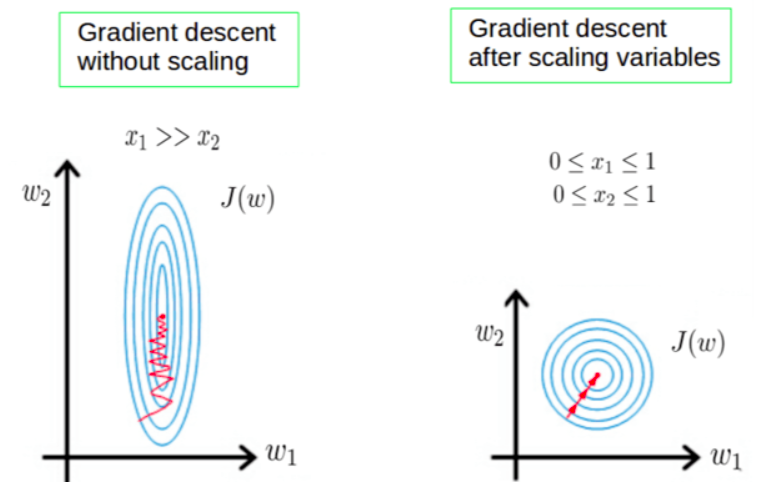

**عملية تقييس الخصائص** (Feature Scaling) **توحِّد قيَم المتغيرات المتفاوتة لتكون على مقياس مماثل**.

مثال: عدد الغرف يتراوح بين 1 - 10 بينما تتراوح مساحة المنزل بين 100 - 1000 متر مربع.

- ونريد للنموذج أن يفهم أن 10 في عدد الغرف شيء كبير، كما أن 1000 في مساحة المنزل شيء كبير أيضًا بالمقارنة. ونريده أن يفهم العكس كذلك: أن 1 صغير في عدد الغرف و 100 في مساحة المنزل شيء صغير بالمقارنة.
- كما أننا لا نريد للنموذج أن يُهمِلَ الأعداد 1 - 10 لكونها قليلة في الحساب عند مقارنتها مع المساحة التي تتراوح بين 100 - 1000.

## أهميتها

تظهر أهمية ذلك في خوارزمية النزول التدريجي (SGD). إذْ تتأثر الخطوة -في اتجاه تقليل الخطأ- بتفاوت قيَم المتغيرات.

يظهر في الشكل هذه الدوائر التي تمثل كلُّ منها قيمة ثابتة للخسارة، ويمثل المركز قاع دالة الخطأ.

الحالة اليسرى: ($x_1 >> x_2$) وتعني أن قيَم المتغير الأول أكبر بكثير مقارنةً بقيَم المتغير الثاني. تصبح تضاريس دالة الخطأ $J(w)$ (وهي: $MSE$) غير متناسقة؛ مما يظهر في أن أي تغيير بسيط في المعامل $w_1$ (المرتبط بالمتغير الكبير) يؤدي إلى قفزة هائلة في دالة الخطأ، بينما التغيير في $w_2$ لا يكاد يُذكر.

الحالة اليمنى: بمجرد وضع المتغيرات على نفس المقياس، تتحول تضاريس دالة الخطأ إلى **دوائر متمركزة**. تصبح الحساسية تجاه $w_1$ و $w_2$ متساوية تقريباً.

**النتيجة:** الخط الأحمر الآن ينطلق **كالسهم مباشرة نحو المركز**. لا يوجد تذبذب ولا ضياع للوقت؛ الخوارزمية تجد أقصر طريق ممكن لتقليل الخسارة.

للمزيد راجع: [أهميَّة التقييس](https://scikit-learn.org/stable/auto_examples/preprocessing/plot_scaling_importance.html).

## كيفياتها

وهناك طبيعتان لطرق **التقييس**: خطية ولا خطيَّة.

### أولاً: **الخطية**

وهي لا تغيِّرُ نسبة ما بين القيَم نفسها.

ولها طريقتان معروفتان:

#### الطريقة الأولى: تقييس النطاق بين الصفر والواحد

في المكتبة ([`MinMaxScaler`](https://scikit-learn.org/stable/modules/generated/sklearn.preprocessing.MinMaxScaler.html))، وتعني تحويل القيم من نطاقها الأصلي إلى نطاق ثابت، عادةً من 0 إلى 1.

$$
x_\text{scaled} = \frac{x - x_\text{min}}{x_\text{max} - x_\text{min}}
$$

**المناسبة**: عندما تكون البيانات موزعة **توزيعاً منتظماً** (Uniform Distribution).

#### الطريقة الثانية: تقييس النطاق بالمقياس الطبيعي

في المكتبة ([`StandardScaler`](https://scikit-learn.org/stable/modules/generated/sklearn.preprocessing.StandardScaler.html))، إذْ يتم مركزة القيَم حوْلَ الصفر (بطرحها من المتوسط)، وتكون القيَم بين ثلاث درجات بالنسبة للانحراف المعياري (بقسمتها عليه).

يتم حساب الدرجة المعيارية $z$ لعينة $x$ كما يلي:

$$
z = \frac{x - \mu}{s}
$$

حيث تمثل $\mu$ و $s$ المتوسط الحسابي والانحراف المعياري لعينات التدريب، على التوالي.

**المناسبة**: عندما تكون البيانات موزعة **توزيعاً طبيعياً** (Normal Distribution) أو قريبًا منه.

**في الممارسة العملية**: غالبًا ما نتجاهل شكل التوزيع ونقوم فقط بتقييس البيانات بالمقياس الطبيعي على أية حال كانت. [@scikit-learn.org]

وفيه يتم اعتبار البيانات التي تقع خارج نطاق -3 إلى +3 درجات معيارية كـ **قيم متطرفة (Outliers)**. وقد يتم إزالتها إن كان لها أثر سلبي على أداء النموذج، ضمن خطوات المعالجة.

### ثانيًا: **لا خطيَّة**

إذْ تغيِّرُ نسبة ما بين القيَم. ومنها:

#### الطريقة الأولى: تقييس لوغارتمي (Log Scaling)

فهي تحوِّل التوزيع غير الطبيعي، المنحاز إلى أحد الجانبين -الموجب أو السالب- إلى **توزيع طبيعي** (Normal Distribution) متناظر باستعمال اللوغاريتم الطبيعي:

$$
x_\text{normalized} = \ln(x)
$$

كما هو موضح في الصورة التالية:

 

مفيدة للبيانات التي تتبع **توزيع قانون القوة (Power Law Distribution)**، والذي يتميز بوجود قلة من نقاط البيانات ذات القيم العالية جداً وكثير من النقاط ذات القيم المنخفضة.

أمثلة:

- عدد قليل من الأفلام يشتهر بقوَّة، بينما الغالبية العظمى تحصل على القليل من الانتباه.
- سكان المدن: إذا قمت بترتيب المدن حسب عدد السكان، ستجد أن أكبر مدينة في الدولة عادة ما تكون ضعف حجم المدينة الثانية، وثلاثة أضعاف حجم المدينة الثالثة (قانون زيف - Zipf's Law). في الولايات المتحدة، يبلغ عدد سكان مدينة نيويورك (حوالي 8.3 مليون نسمة) ضعف حجم مدينة لوس أنجلوس (حوالي 3.8 مليون نسمة) تقريباً.

انظر [تحويل قيمة الهدف](https://scikit-learn.org/stable/auto_examples/compose/plot_transformed_target.html).

---
