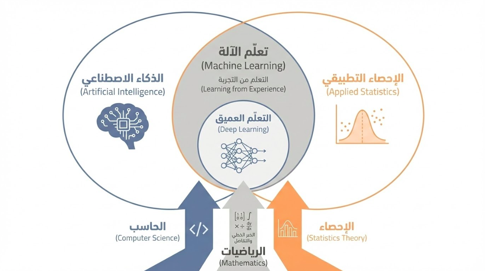
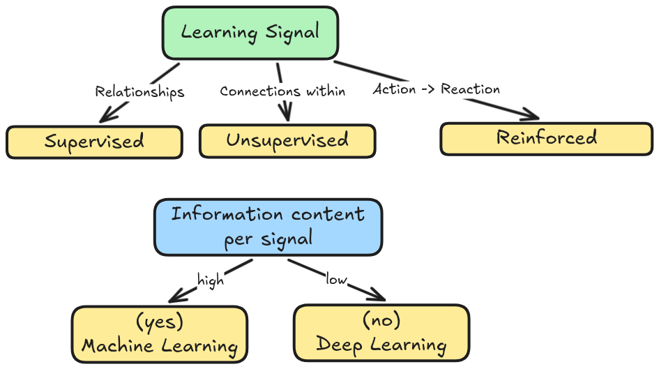
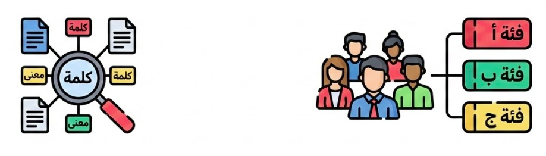
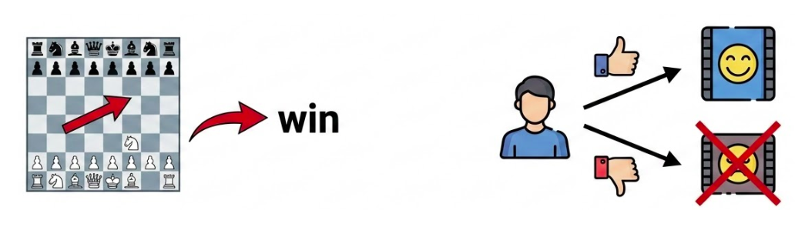

بسم الله الرحمن الرحيم. 

## المبادئ العشرة

قد اشتهر قول **محمد بن علي الصبان** (توفي 1206هـ):

> إنَّ مبادئ كل فن عشرة … الحد والموضوع ثم الثمرة
> 
> وفضله ونسبة والواضع … والاسم الاستمداد حكم الشارع
> 
> فمسائل والبعض بالبعض اكتفى … ومن درى الجميع حاز الشرفا

تُفصل هذه الأبيات الجوانب الأساسية لأي علم كالتالي:

1. **الحد:** تعريف الفن الذي يميزه عن غيره، سواء كان تعريفاً جامعاً مانعاً أو وصفياً.
2. **الموضوع:** المجال الذي يبحث فيه العلم (مثلاً: الكلمات هي موضوع علم النحو).
3. **الثمرة:** الغاية والفائدة المرجوة من تعلم هذا العلم.
4. **النسبة:** علاقة هذا الفن بغيره من الفنون (هل هو مباين لها، أم أصل لها، أم فرع؟).
5. **الفضل:** مكانة العلم وشرفه مقارنة بالعلوم الأخرى.
6. **الواضع:** أول من دوّن العلم أو وضع قواعده الأساسية.
7. **الاسم:** ما يُعرف به العلم وما اشتهر به من أسماء.
8. **الاستمداد:** المصادر التي يُشتق منها العلم ويستقي منها أحكامه وقواعده.
9. **حكم الشارع:** الحكم الفقهي لتعلمه (فرض عين، فرض كفاية، مندوب، إلخ).
10. **المسائل:** القضايا والقواعد الكلية التي تُبحث داخل العلم.

وفيما يلي بيانُها في علم **تعلم الآلة**.

## 1. الـحَدُّ (التعريف)

قيل: هو علم يبحث في قدرة المنطق الآلي على استخراج الأنماط المفيدة من البيانات تلقائيًّا. [@ShalevShwartz2014]

وحسب توم ميتشيل [@mitchell2015intro]: يقال إن البرنامج يتعلم من الخبرة ($E$) بالنسبة لصنف من المهام ($T$) ومقياس أداء ($P$)، إذا تحسن أداؤه في المهام ($T$) كما يقاس بـ ($P$) مع زيادة الخبرة ($E$).

## 2. المَوْضُوع

موضوع هذا العلم هو **البيانات** (Data) من حيث استخلاص **الأنماط** (Patterns) منها. ويبحث في العلاقة بين المدخلات ($X$) والمخرجات ($Y$)، أو في بنية البيانات نفسها في حال غياب المخرجات.

## 3. الـثَّمَرَة

تتلخص ثمرته في **أتمتة الاستدلال**؛ فبينما كان الإنسان قديماً يستنبط القوانين يدوياً، أصبح تعلم الآلة هو الأداة التي تستنبط القوانين من بحور البيانات المتلاطمة (Big Data). ويتجلى ذلك في  **التعميم** (Generalization)؛ أي بناء أنظمة قادرة على اتخاذ قرارات دقيقة تجاه بيانات لم ترها من قبل، وتوفير حلول للمشكلات التي يعجز المنطق البرمجي التقليدي (If-Else) عن حلها، مثل التعرف على الوجوه والأصوات والكلام والترجمة والتحدث والتحرك والتفاعل مع البيئة المحيطة المليئة بالمتغيرات.

## 4. الـفَضْل

هو محرك الثورة التقنية الحالية.

وتتحتم الاستعانة به في سياقين لا تفي بهما البرمجة القواعدية الجامدة:

أولهما: **استعصاء المهمة على الصياغة الإجرائية**، ويتمثل ذلك في عجز الإنسان عن تفكيك أسرار ممارساته الفطرية —كالإدراك البصري والكلامي— ليصيغها في قواعد رقمية، أو في ضخامة البيانات التي تفوق بطبيعتها حدود الاستيعاب والتحليل البشري.

وثانيهما: **الحاجة للتكيف المستمر**؛ فبينما تتسم البرمجيات التقليدية بالجمود حيال المتغيرات، يمنح تعلم الآلة الأنظمة قدرةً ذاتية على تطويع سلوكها وفقاً للخبرة المكتسبة والمستجدات المحيطة، محولاً إياها من أدوات ثابتة إلى كيانات مرنة تتطور بتطور التجربة.

## 5. الـنِّسْبَة

- **بالنسبة للذكاء الاصطناعي:** هو جزء من كل.
- **بالنسبة للإحصاء:** هناك تداخل عميق يُعرف بـ **التعلم الإحصائي** (Statistical Learning)، إلا أن تعلم الآلة يركز أكثر على الأداء التنبؤي والنجاعة الحاسوبية، بينما يركز الإحصاء التقليدي على الاستدلال وصحة الفرضيات.
- أما **التعلّم العميق** (Deep Learning): فهو فرع. وهو نمط من التعلم يعتمد على بنية شبكات عصبية اصطناعية متعددة الطبقات، تقوم باستخلاص الميزات من البيانات الخام بشكل هرمي وتلقائي، بدءاً من البسيط إلى المعقد.

## 6. الاسْـتِمْدَادُ

يستمد هذا العلم أدواته من ثلاثة روافد أساسية:

1. **الرياضيات:** 
   1. الجبر الخطي (Linear Algebra)
   2. وحساب التفاضل والتكامل (Calculus)
   3. [والتحسين (Optimization)](https://en.wikipedia.org/wiki/Mathematical_optimization)
2. **الإحصاء والاحتمالات:** (Statistic & Probability Theory).
3. **علوم الحاسب:** هو تطبيق لمبادئ الخوارزميات وهياكل البيانات.



## 7. الـوَاضِع

لا ينسب لشخص واحد، بل هو تراكم معرفي:

1. **التأسيس** (1950): [اختبار تورينج](https://plato.stanford.edu/entries/turing-test/) ووضع حجر الأساس الفلسفي للذكاء الميكانيكي.
2. **المنطق** (1956): ورشة دارتموث وظهور **الأنظمة الخبيرة** المعتمدة على القواعد. 
3. **البيانات** (1990s): التحول من القواعد اليدوية إلى الإحصاء وتعلم الآلة (ML).

## 8. الاسْم

يُعرف بـ **تعلم الآلة (Machine Learning)**، ويطلق عليه في الأوساط الأكاديمية الصرفة **التعلم الإحصائي (Statistical Learning)**، وفي سياقات أخرى **استخراج الأنماط (Pattern Recognition)** أو **التنقيب في البيانات (Data Mining)**، مع فروقات طفيفة في التركيز.

## 9. المَـسَائِل

وتنقسم مسائله الكلية بحسب **إشارة التعلم** (Learning Signal) إلى ثلاثة أقسام رئيسية:

1. **التعلم الإشرافي** (Supervised Learning): حيث الإشارة موجودة مع البيانات.
2. **التعلم اللا إشرافي** (Unsupservised Learning): حيث الإشارة هي البيانات نفسها.
3. **التعلم بالتعزيز** (Reinforcement Learning): حيث الإشارة هي ردة فعل من البيئة التي يعمل فيها العميل المتعلم.



### القسم الأول: التعلم الإشرافي (Supervised Learning)

حيث تكون **البيانات موسومَة** (Labeled Data)؛ فيتم تدريب النموذج على مدخلات معلومة النتائج؛ ليتعلم رسم خريطة بين المدخل والمخرج تلقائيًّا.

- مثل **حالة الطقس**: التنبؤ بحالة الطقس غدًا بناء على بيانات تاريخية مسجَّلة للمنطقة الجغرافية.
- مثل **تنظيم النشر:** عبر برمجيات تتعلم تمييز المنشورات المزعجة والمسيئة لتمنعها من الظهور.
- ومثل **تصنيف الصور (التعلم العميق):** عبر أنظمة تتعرف على السمات المميزة للأشياء أو الأوجه أو الأماكن لتحديدها من الصور في كاميرات الفيديو.


### القسم الثاني: التعلم  اللا إشرافي (Unsupervised Learning)

حيث لا يوجد وَسم صريح؛ بل الغرض كشف النمط الكامن في نفس البيانات: كالتشابه فيما بينها أو التكتل والتجمع حول قيَم معيَّنة، وكذلك تبسيطها.

- مثل **محركات البحث:** عبر أنظمة فهرسة تلقائية وتمكين البحث فيها بالكلمة والمعنى.
- ومثل **التحليل التسويقي:** تقسيم قاعدة العملاء إلى فئات متجانسة بناءً على السلوك الشرائي.
- ومثل **مشابهة الصورة (التعلم العميق)**: حيث يمكن البحث عن الصور المتشابهة بلا تصنيف مسبق (أشياء، أشخاص، حيوانات، أجواء، مناطق، ...إلخ)



### القسم الثالث: التعلم التعزيزي (Reinforcement Learning)

وهو نوع من التعلم يقوم على التفاعل مع البيئة المحيطة؛ وبناءً على هذا التفاعل تُرصَدُ الإشارة وتُفسَّر بالسلب أو الإيجاب؛ وينبني على ذلك تعزيز السلوك أو تثبيطه.

- مثل **أنظمة التوصية:** حيث يتم رصد إشارة الإعجاب أو عدمه من المستخدمين (البيئة) بناءً على توصيات الخوارزمية، فيتم تفسيرها بالسلب والإيجاب لتحسين التوصيات القادمة.
- ومثل **الألعاب المعقدة:** تحسين الأداء في ألعاب مثل الشطرنج و`Go` و`Dota 2`.
- ومثل **الروبوتات**: الذراع الآلية، الجسم الآلي، أو المركبة أو الطائرة الآلية.



وكل ما سبق من الثمرات يتحقق بمجموع الأقسام لا بمفردها، بل وباستعمال القواعد وهندسة البرمجيات معها.

## مثال تقريبي: الفرق بين الترجمة بالقواعد الإجرائية و الترجمة بالإحصاء

ملاحظة: النص البرمجي مولَّد بالذكاء الاصطناعي، والمراد منه فقط الفكرة العامة، فلا تدقق في التفاصيل -بارك الله فيك-.

### الترجمة بالقواميس والقواعد اللغوية

في هذا النموذج، يقوم المبرمج بدور اللغوي. حيث يجب عليه كتابة كل قاعدة نحوية وكل مفردة يدوياً. إذا لم تكن القاعدة مكتوبة في الكود، فلن يفهمها النظام:

```python
def rule_based_translate(sentence):
    # Dictionary (Lexicon)
    dictionary = {
        "the": "el",
        "cat": "gato",
        "is": "está", 
        "black": "negro",
        "house": "casa"
        ...
    }
    
    words = sentence.lower().split()
    translated = []
    
    for i, word in enumerate(words):
        # Rule 1: Direct word-for-word mapping
        trans_word = dictionary.get(word, word)
        
        # Rule 2: Spanish Adjective Placement 
        # (e.g., "black cat" -> "gato negro")
        if word == "black" and i > 0 and words[i-1] == "cat":
            # Swap previous word with current translation
            ...
        else:
            ...

        # Rule 3: ...
        
        # Rule 4: ...

    return " ".join(translated)

print(rule_based_translate("the black cat"))
                  # Output: el gato negro
```

يتطلب هذا النوع جهداً بشرياً هائلاً لصياغة آلاف القواعد لكل لغة، ويصعب عليه التعامل مع الاستثناءات اللغوية.

### الترجمة الإحصائية بالبيانات المتوازية

هنا يبدأ تعلم الآلة. نحن لا نعطيه قواعد بل نعطيه بيانات متوازية (جمل مقابل ترجتمها)، وهو يستنتج الأنماط والاحتمالات وحده.

```python
from collections import defaultdict, Counter

# SMT: Learning from data (Parallel Corpus)
parallel_data = [
    ("the cat", "el gato"),
    ("the house", "la casa"),
    ("the black cat", "el gato negro"),
    ("the black house", "la casa negra")
]

def train_smt(data):
    # Count occurrences of source-target word pairs
    counts = defaultdict(Counter)
    for src, tgt in data:
        for s_word in src.split():
            for t_word in tgt.split():
                counts[s_word][t_word] += 1
    
    # Calculate Probability: P(target | source)
    model = {}
    for s_word, t_variants in counts.items():
        total = sum(t_variants.values())
        model[s_word] = {t: count / total for t, count in t_variants.items()}
    return model

def smt_translate(sentence, model):
    words = sentence.lower().split()
    # Pick the target word with the highest probability
    return " ".join([max(model[w], key=model[w].get) for w in words])

model = train_smt(parallel_data)
print(smt_translate("the black cat", model))
            # Output: el gato negro
```

### ملخص الفرق في جدول

| **الميزة**         | **القواعد (RBMT)**          | **الإحصاء (SMT)**            |
| ------------------ | --------------------------- | ---------------------------- |
| **المصدر الأساسي** | علماء لغويات وقواميس        | بيانات ضخمة (Big Data)       |
| **المنطق**         | "إذا حدث هذا، افعل ذاك"     | حساب احتمالات وأنماط         |
| **الصيانة**        | صعبة (تعديل القواعد يدوياً) | سهلة (إضافة بيانات أكثر فقط) |

ومن ميزات تعلم الآلة: التكيُّف مع تغير اللغة بل مع استعمالات الألفاظ في السياقات المختلفة مع اختلاف الأزمنة.

---

التالي: [كيف تتعلم الآلة؟](../02_supervised_learning/supervised_learning.qmd)