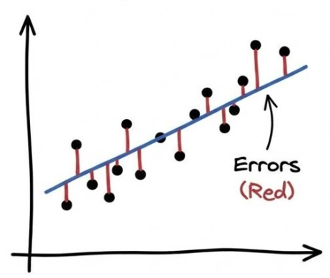
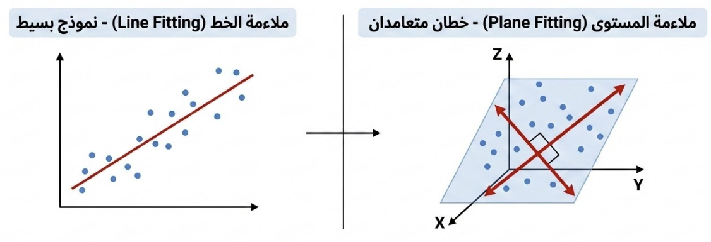

بسم الله الرحمن الرحيم.

نشرع في أول أقسام علم تعلم الآلة: **التعلم بالإشراف** (Supervised Learning) ويعني وجود إشارة التعليم التي تربط السبب بالنتيجة: من $x$ (المعطيات) إلى $y$ (المخرجات).

## المقادير المتصلة والمنفصلة في  المدخلات والمخرجات

والبيانات -سواءٌ معطيات أو مخرجات- تشمل كل معلومٍ جزئيٍّ من المقادير العددية المتصلة أو المنفصلة. وتختلف طريقة بناء نموذج التعلم ومعايرته باختلافها في المعطيات تارة، وفي المخرجات تارة أخرى.

فأما **المتصل** فالأعداد الممثلة لدرجة للحرارة والرطوبة أو سرعة الرياح أو ثقل الحجر أو أسعار السلع والقارات ونحوها.

يعبر عنها بأعداد الفاصلة العائمة (Floats):

* **موجب كبير:** $1,500,750.50$ (سعر أصل مالي).
* **سالب:** $-15.25$ (درجة التجمد).
* **صغير جداً:** $0.000007$ (تركيز كيميائي).

وأما **المنفصل** فقسمان:

الأول: **المرتب**. كالأرقام الدالة على المركز الأول والثاني، والصف الثالث والرابع، والدرجة الخامسة والسادسة، ونحو ذلك مما **لا يُشترط فيه تساوي المسافة بين قيَمِه** لكن كالعدد يُمكن المقارنة بين أجزائه.

يعبر عنها بالأعداد صحيحة (Integers) مثل:

* **رتب متسلسلة:** $1, 2, 3$ (الأول، الثاني، الثالث).
* **تقييم نسبي:** $-1, 0, 1$ (معارض، محايد، مؤيد).

الثاني: **غير مرتَّبٌ**. كالأرقام الدالة على والوجود والعدم للسمات مثل: الحمرة والصفرة، والتلف والسلامة في المصنوعات، والتعفن والنضج وعدمه في المطعومات، والحميد والخبيث في الأورام، ونحو ذلك مما هو **غير قابل للمقارنة؛ إذْ هو صفة**.

ويعبر عنها أيضًا بالأعداد الصحيحة (Integers) مثل:

* **ترميز ثنائي:** $0, 1$ (عدم، وجود) أو (سليم، مصاب).
* **فئات متعددة:** $101, 102, 103$ (ترميز للمدن أو فصائل الدم).

## التعلم من البيانات الموسومة

ونمثل على ذلك بمهمة بناء نموذج الهدف منه: **تقدير أسعار العقار**.

فأما العوامل المؤثرة في التقدير فتسمى **الخصائص** (Features). منها: المساحة، وعدد الأدوار، وعدد الغرف، والموقع، وما يجاوره، وكثير غيرها .. إلا أننا نقرِّبُ المثال بالنظر إلى عاملٍ واحد وهو: **المساحة**؛ ونحاوِلُ تقدير **سعر البيت**؛ ويسمى: **الهدف** (Target).

ثم ننظر في أعيان من البيوت وأسعارها؛ باعتبارها زوْجًا. وكل زوجٍ يسمى هنا **مشاهدة** (Observation)؛ فتُجمَعُ في جدوَل كهذا:


1. فأما المساحة (من الخصائص) فهي **المتغير المستقل** (Independent Variable)؛ ويرمز له عادة بالرمز: $x$
2. وأما السعر (من الهدف) **المتغير التابع** (Dependent Variable)؛ ويرمز له عادة بالرمز: $y$

ونحن في هذه التسمية نفترضُ أن العلاقة بين هذين المتغيرين (المساحة والسعر) السببُ فيها هو المساحة، والمسبَّبُ هو السعر. 

ثم تُنقَطُ في رسم يضع المتغير المستقل أفقيًّا ($x$)، والتابِعَ عموديًّا عليه ($y$)، فتمثل كل نقطة منها مشاهدة ($(x,y)$).

ثُمَّ تُخطُّ العلاقة بينهما بالنظر. **وهو النموذج (Model) الذي نسعى لخطِّه خوارزميًّا**، على نحو هذا الشكل:


## موضع التنبؤ

وإن ثقتنا في قدر التنبؤ الداخلية أعلى منها في الخارجية؛ لأننا في منطقة قريبة من مشاهدات التدريب. وكلما ابتعد التبنؤ عن بيانات التعلم زاد مورد الخطأ فيه:

- **داخلي (Interpolation)**: هو التنبؤ بقيمة $y$ لـ $x$ تقع **بين** أصغر وأكبر قيمة في بيانات التدريب.
- **خارجي (Extrapolation)**: هو التنبؤ بقيمة $y$ لـ $x$ تقع **خارج** حدود البيانات (أكبر من أقصى قيمة أو أصغر من أدنى قيمة).

## نموذج الانحدار الخطي (Linear Regression)

**الانحدار** (Regression) لغةً النزول، واصطلاحًا الرجوع. وسبب التسمية يعود لدراسة في الثمانينات من القرن التاسع عشر (Regression towards mediocrity in hereditary stature) حيث لاحظ فيها غالتون أن الأبناء من الآباء القصار والطوال يعودون إلى الطول الطبيعي.

ومعنى **الخطي** (Linear) لأن المستقيم يمثل علاقة ثابتة بين المتغير المستقل ($x$) والمتغير التابع ($y$) زيادةً ونقصانًا. وتظهر هذه العلاقة هندسياً **كخط مستقيم** (Line) في الفضاء ثنائي الأبعاد (2D)، أو كمستوى (Plane) في الأبعاد الثلاثية (3D)، أو كمستوى فائق (Hyperplane) في الأبعاد الأعلى (ND).

ومعادلة الخط المستقيم هي:

$$
y = mx+b
$$

فأما **المعاملات** (Parameters) فهي المتغيرات التي تشكل انحناء الخط ($m$) والنقطة ($b$) التي يقطع فيها المحور العمودي. فمثلاً:

فمثلاً: **النموذج (أ):** عند $m=2$ و $b=1$ تكون المعادلة $y = 2x + 1$. (خط مزاح للأعلى بمقدار وحدة واحدة، ويرتفع بمقدار وحدتين كلما اتجهنا أفقيًا في اتجاه الموجب).

وهذا يظهر بالحساب:

|  $x$ | ($2x + 1$)  |  $y$ |
| ---: | :---------- | ---: |
| $-2$ | $2(-2) + 1$ | $-3$ |
| $-1$ | $2(-1) + 1$ | $-1$ |
|  $0$ | $2(0) + 1$  |  $1$ |
|  $1$ | $2(1) + 1$  |  $3$ |
|  $2$ | $2(2) + 1$  |  $5$ |

ويمكن أن نخط هذا النموذج:


ننشئ مجموعة خطوط مستقيمة للتدرب على المعادلة لنتعرف عليها عن قُرب:

| **نوع العلاقة**    | $b$  | $m$   | **التوصيف**                                          |
| ------------------ | ---- | ----- | ---------------------------------------------------- |
| **طردية (مثال 1)** | $1$  | $2$   | زيادة واضحة: كلما زاد $x$ زاد $y$ بمقدار الضعف.      |
| **طردية (مثال 2)** | $3$  | $0.5$ | زيادة طفيفة: $y$ ينمو ببطء مع زيادة $x$.             |
| **عكسية (مثال 1)** | $5$  | $-1$  | تناقص متساوٍ: كلما زاد $x$ نقص $y$ بنفس المقدار.     |
| **عكسية (مثال 2)** | $10$ | $-3$  | تناقص حاد: هبوط سريع في قيمة $y$ مع كل زيادة في $x$. |
| **لا علاقة**       | $4$  | $0$   | حيث: $y = b$ (خط أفقي)، $y$ لا يتأثر بتغير $x$.      |

الشكل التالي يبين جميع هذه الخطوط المستقيمة:


ملاحظة: تتعدد الرموز في المراجع العلمية لوصف نفس الدالة الخطية، ومن أشهرها:

1.  الصيغة العامة:
$$f(x) = ax + b$$
2. صيغة الفرضية الشائعة في الأبحاث (الحرف اللاتيني: ثيتا):
$$h_{\theta}(x) = \theta_0 + \theta_1 x$$
3. الصيغة الشائعة في الإحصاء (الحرف اللاتيني: بيتا):
$$y = \beta_0 + \beta_1 x$$
4. صيغة الأوزان (Weights) الشائعة في الشبكات العصبية الاصطناعية (التعلم العميق):
$$f(x;w) = w_1 x + w_0$$ 
وكلها ترمز إلى نفس الأمر: معادلة خط مستقيم.

وقد يتم تعريف ناتج الدالة بوضع مثلث فوق الحرف $y$ ليكون هكذا:
$$
\hat{y} = f(x;w)
$$

- ونقرؤها هكذا: إن التقدير $\hat{y}$ ناتج عن عمل الدالة النموذج $f$ على الخصائص $x$ المضبوط وِفق المعاملات $w$.
- فأما الناتج $\hat{y}$ (بتحريك الحرف $y$) فلتمييز النتيجة التقديرية $\hat{y}$ عن الحقيقية في البيانات $y$ .. (وذلك لأننا سنقارن بين ما يتوقعه النموذج وبين الحقيقة، لتقييم قدرته التنبؤية).

## كيفية تدريب نموذج انحدار خطي في بايثون

- نستعمل حزمة `sklearn` المتضمنة لأدوات تعلم الآلة، ومن ذلك:
	- نموذج `LinearRegression` من وحدة النماذج الخطية `sklearn.linear_model`

```python
from sklearn.linear_model import LinearRegression
import numpy as np
```

- ثم نعرف البيانات كمصفوفة من حزمة `numpy` ذات الكفاءة العالية في الحساب المصفوفات (Matrices) والمتجهات (Vertices) الرياضية. وهي مصفوفتان:
	- مصفوفة الخصائص، ويُرمز لها بالـ`X` وشكلها:
		- كل صف يمثل مشاهدة
		- كل عمود يمثِّل ميزة
		- الخلية (التقاطع) يمثل قيمة الميزة في تلك المشاهدة
	- مصفوفة الهدف `y`

```python
X = np.array([[1], [2], [3], [4]]) # المدخلات
y = np.array([2, 4, 6, 8])        # المخرجات
```

- لنفترض أن العوامل الصحيحة هي $y=2x$ (الآلة لا تعرف هذه القاعدة، بل تتعلمها)؛ لكننا نعرف أن النمط خطي

```python
model = LinearRegression()
```

- عملية الاستقراء (التعلم)

```python
model.fit(X, y)
```

ملاحظة: في حزمة `sklearn` تخزن العوامل بعد عملية التدريب على البيانات في نموذج الانحدار الخطي `LinearRegression` في الخاصيتين:
- الميل $b$ باسم: `coef_`
- التقاطع $m$ باسم: `intercept_

والآن:

- التنبؤ بحالة جديدة بناءً على العلاقة المستقرأة

```python
new_case = np.array([[5]])
prediction = model.predict(new_case)

print(f"التنبؤ للقيمة 5 هو: {prediction[0]}") # النتيجة ستكون 10 تقريباً
```

وقد تتساءل: كيف تعمل الخوارزمية التي تتعلم كيف تلائم النموذج للبيانات؟

الجواب: يجب أن نضع هدفًا لنصل إليه بطريقة خوارزمية.

## ملاءمة النموذج للبيانات

يقيَّم النموذج بحسب ملاءمته للنمط التي تمثله البيانات (النقاط)؛ ويتم قياس ذلك بالمسافة العموديَّة لأنها تمثل الفرق بين التوقُّع والحقيقة: $y_i - \hat{y_i}$ لنقطةٍ ما.



ويلخص التقييم في رقمٍ واحد، هو متوسط مطلق الفروق -سلبًا أو إيجابا- بين كل نقطة مسجَّلة $(x_i,y_i)$ وما تنبأ به النموذج -الخط- الممثل بـ $(x_i, \hat{y}_i)$. والوصف الرياضي الرمزي لذلك هو:

$$
\text{MAE} = \frac{1}{m}\sum_1^m{\vert y_i - \hat{y}_i \vert}
$$

حيث:

- كلمة MAE تعني Mean Absolute Error؛ أي: متوسط مطلق الخطأ (سلبًا أو إيجابًا).
- القيمة $m$ هي عدد البيانات

وقد تستعمل الخوارزمية أيضاً متوسط مربعات الخطأ (MSE) ليكون أثر النقاط القريبة وإن تعددت، أقل منه في النقطة الواحدة البعيدة:

$$
\text{MSE} = \frac{1}{m}\sum_1^m{(y_i - \hat{y}_i)^2}
$$

هل تلاخظ أي من مجموعتي البيانات الموضحة في الرسم التالي لديها **متوسط مربعات خطأ (MSE)** أعلى؟


**النتيجة:** مجموعة البيانات الموجودة على **اليمين** لديها متوسط مربعات خطأ (MSE) أعلى، رغم أنها تحتوي على عدد نقاط أقل، وذلك لأن المسافة بين تلك النقطة والخط كانت كبيرة جداً بما يكفي لرفع المتوسط.

## النزول التدريجي (Gradient Descent)

تقوم خوارزمية التعلم بتحسين أداء النموذج للنزول إلى أقل خطأ يمكن النزول إليه.

وعلم الجبر الخطي (Linear Algebra) ينظر إلى البيانات على أنها نظام من المعادلات، فيحلُّها بطريقة تحليلية (Analytical)، فيستطيع أن يضبط المعاملات بما يضع الخطأ في أقل قيمة ممكنة. ويمثله في المكتبة: [`sklearn.linear_model.LinearRegression`](https://scikit-learn.org/stable/modules/generated/sklearn.linear_model.LinearRegression.html).

لكن قد يحول بيننا وبين استعمال الحل التحليلي: كِبَرُ حجم البيانات لكثرتها. فعند ذلك نلجأ لحل تقريبي يقوم على التحسين شيئًا فشيئًا.

**النزول التدريجي العشوائي** (Stochastic Gradient Descent) يقوم على تقسيم البيانات باختيارها بشكل عشوائي، وتحديث الأوزان (المعاملات) بناءً على كل نقطة يتم تحميلها إلى الذاكرة، ثم التالية، والتالية، وهكذا يستطيع التعلم من الكم الهائل من البيانات. والتجرِبَة تقول إن هذا الحل التقريبي ليس ببعيد عن الحل الأمثل الذي تنتجه لنا الطريقة الأولى التحليلية.

ويمثله في المكتبة:  [`sklearn.linear_model.SGDRegressor`](https://scikit-learn.org/stable/modules/generated/sklearn.linear_model.SGDRegressor.html).

وهي خوارزمية **تحسين** (Optimization) تعمل بالاشتقاق لمعرفة نسبة الخطأ لكل معامل، ليتِمَّ تغيير المعامِل -بالزيادة أو النقص- بما يقلل نسبته فيه. وتتم بالإجراء البسيط التالي:

- تبدأ جميع العوامل بقيَم عشوائية
- نغيرها قليلاً بالزيادة أو النقص
- نرصد الخطأ
- إذا ارتفع الخطأ عكسنا اتجاه التغيير؛ وإلا فهو ينقص، أو على الأقل لا يزيد

يبين الرسم المتحرك التالي جانبان لهذه الخوارزمية:


الأيمن: **رسم بياني وخطي (Line Graph)**  فيه المتغير المستقل في المحور الأفقي ($x$) والمتغير التابع في المحور العمودي ($y$) ويظهر فيه اقتراب النموذج -الخطي- شيئًا فشيئًا من مجموع البيانات ليلائم نمطها.

الأيسر: **مُنحنى الخسارة (Loss Curve)**: فيه أحد المعاملات -الذي هو الميل- على المحور الأفقي، مقابل دالة حساب الخطأ (MSE) على المحور العمودي. واشتقاق هذه الدالة بالنسبة للميل؛ يعطيِنَا اتجاه النزول الذي يجب أن نعدِّلَ الميل ليحصل. ويكون هذا بالتدرُّجِ خطوة خطوة.


## علاقة مركَّبة من مجموع متغيرات مستقلة

رأينا فيما سبق إيجاد علاقة أحاديَّة: بين **السعر** (وهو المتغير التابع $y$) **والمساحة** (وهي المتغير المستقل $x$).

يقبل نموذج الانحدار الخطي العلاقة المكونة من عدة متغيرات مستقلة:  ($x_1, x_2, \dots$ إلخ) وبين المتغير التابع: ($y$). حيث تضاف المتغيرات إلى المعادلة الخطية على هذا النحو:
$$
\hat{y} = f(x_1, x_2, \dots) = w_1 x_1 + w_2 x_2 + \dots + b
$$

لو أردنا مثلاً أن نعتبر تأثير عدد الغرف بالإضافة إلى المساحة في سعر البيت، فإنها ستكون هكذا:

$$
\hat{y} = f(\text{area}, \text{rooms}) = w_1\text{area} + w_2\text{rooms} + b
$$

هذا النموذج يعادل وجود خطين، حيث يخضع الخط الثاني لقيد يجعله متعامداً على الخط الأول (بزاوية 90 درجة). ونتيجة لذلك، يشكلان معاً **مستوًى**. لذا، يمكن وصف هذه العملية بأنها **ملاءمة مستوى (Plane fitting)** بدلاً من ملاءمة خط (Line fitting).



وقس على ذلك زيادة الخصائص إلى ثلاثة وأربعة كإضافة عمر البيت وموقعه مثلاً، وأكثر من ذلك. فإننا قد لا نستطيع تخيُّلَ ذلك إلا أن خوارزميَّة التعلم هي هي: تضبِطُ المعاملات (Parameters) / الأوزان (Weights) بما يقلل الخطأ تدريجيًّا للوصول إلى أقلِّ خطًأ.

**لكن تظهر مشكلة جوهريَّة عندما نحاول اعتبار مجموع متغيرات متفاوتة في القيَم. ما هي هذه المشكلة وكيف نحلها؟ [نتابع في الدرس القادم](../03_multi/01_scale.qmd).**

---

- [التمرين الأول: البطاريق](./exercises/01_eda_penguins_ex.ipynb)
- [التمرين الثاني: الانحدار الخطي](./exercises/02_linear_regression_ex.ipynb)