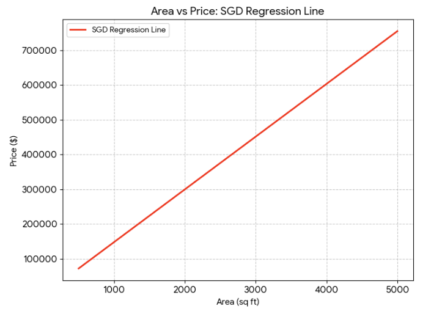
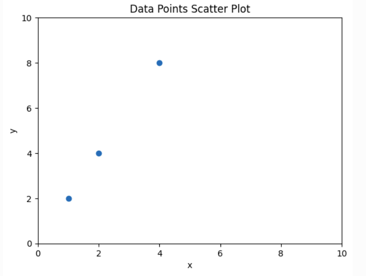
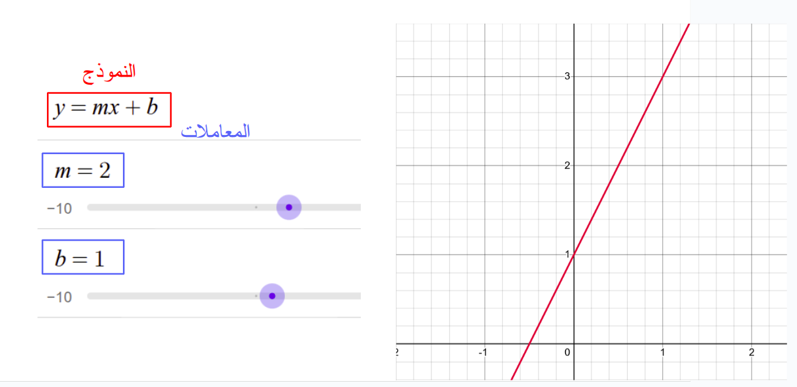

## التعلم بالإشراف (Supervised Learning)

-   وجود **إشارة التعليم** (Labels).
-   يربط السبب بالنتيجة: من $x$ (المعطيات) إلى $y$ (النتائج).
-   أمثلة:

|  الصناعة |   مهمة النموذج |       المعطيات |
|---------:|---------------:|---------------:|
| العقارات | تقييم العقارات | المساحة، الغرف |
|  التسويق |         العائد |      الإعلانات |

::: notes
نشرع في أول أقسام علم تعلم الآلة: **التعلم بالإشراف** (Supervised Learning) ويعني وجود إشارة التعليم التي تربط السبب بالنتيجة: من $x$ (المعطيات) إلى $y$ (النتائج).
:::

## مثال: العقار

-   **الخصائص (Features)**: العوامل المؤثرة (مثل المساحة). يرمز لها بـ $x$ (المتغير المستقل).
-   **الهدف (Target)**: القيمة المراد تقديرها (مثل السعر). يرمز له بـ $y$ (المتغير التابع).
-   **المشاهدة (Observation)**: كل زوج من البيانات $(x,y)$.


::: notes
فأما العوامل المؤثرة في التقدير فتسمى **الخصائص** (Features). منها، في مثال تقدير سعر البيت: المساحة، وعدد الأدوار، وعدد الغرف، ونحو ذلك .. إلا أننا نقرِّبُ المثال بالنظر إلى عاملٍ واحد وهو: **المساحة**. وتسمى **المتغيرات المستقلة** (Independent Variables).

ونحاوِلُ تقدير **سعر البيت**؛ ويسمى: **الهدف** (Target). ويسمى **المتغير التابع** (Dependent Variable).

وكل زوجٍ يسمى هنا **مشاهدة** (Observation).
:::

## تمثيل البيانات

-   تُمثل البيانات كنقاط في رسم بياني.
-   المتغير المستقل ($x$) أفقيًا.
-   المتغير التابع ($y$) عموديًا.


## خط النموذج (Model)

-   الهدف: رسم علاقة (نموذج) بين $x$ و $y$.
-   بعد بناء النموذج، لا نحتاج للنقاط للتنبؤ.

 

## الانحدار الخطي (Linear Regression)

-   **الانحدار**: الرجوع إلى المتوسط.
-   **الخطي**: علاقة مستقيمة.
-   المعادلة: $$
    y = mx+b
    $$
-   $m$: الميل (Slope).
-   $b$: التقاطع مع المحور العمودي (Intercept).


::: notes
**الانحدار** (Regression): لغةً النزول، واصطلاحًا الرجوع. **الخطي** (Linear): لأن المستقيم يمثل علاقة ثابتة بين المتغير المستقل ($x$) والمتغير التابع ($y$) زيادةً ونقصانًا.

فأما **المعاملات** (Parameters) فهي المتغيرات التي تشكل انحناء الخط ($m$) والنقطة ($b$) التي يقطع فيها المحور العمودي.
:::

## أشكال العلاقات الخطية

|  العلاقة |  $m$ |                الوصف |
|---------:|-----:|---------------------:|
|    طردية | موجب | كلما زاد $x$ زاد $y$ |
|    عكسية | سالب | كلما زاد $x$ نقص $y$ |
| لا علاقة |  صفر |   خط أفقي ($y$ ثابت) |


## الرموز (Notation)

تتعدد الصيغ الرياضية لنفس المعنى (معادلة خط مستقيم):

1.  الجبر: $$f(x) = ax + b$$
2.  الأبحاث ($\theta$): $$h_{\theta}(x) = \theta_0 + \theta_1 x$$
3.  الإحصاء ($\beta$): $$y = \beta_0 + \beta_1 x$$
4.  التعلم العميق ($w$): $$\hat{y} = w_1 x + w_0$$

::: notes
وكلها ترمز إلى نفس الأمر: معادلة خط مستقيم. وقد يتم تعريف ناتج الدالة بوضع مثلث فوق الحرف $y$ ليكون $\hat{y}$ لتمييز النتيجة التقديرية عن الحقيقية $y$.
:::

## البيانات: متصلة أم منفصلة؟

-   **متصلة (Continuous)**:
    -   أرقام عشرية (Floats).
    -   مثال: الحرارة، السعر.
-   **منفصلة (Discrete)**:
    -   أرقام صحيحة (Integers).
    -   **مرتب (Ordinal)**: الأول، الثاني (يمكن المقارنة).
    -   **غير مرتب (Nominal)**: ألوان، أسماء (لا مقارنة).

## الانحدار vs التصنيف

الفرق يعتمد على نوع المتغير التابع ($y$):

1.  **الانحدار (Regression)**:
    -   توقع قيمة **متصلة** (سعر، درجة).
    -   مثال: `LinearRegression`.
2.  **التصنيف (Classification)**:
    -   توقع فئة/صنف (ناجح/راسب، قطة/كلب).
    -   مثال: `LogisticRegression`.

## التطبيق في Scikit-Learn

``` python
from sklearn.linear_model import LinearRegression
import numpy as np

# مصفوفة الخصائص X (ثنائية الأبعاد)
X = np.array([[1], [2], [4]]) 
# متجه الهدف y
y = np.array([2, 4, 8])        
```



## التدريب (Fitting)

``` python
# إنشاء النموذج
model = LinearRegression()
# تدريب النموذج على البيانات
model.fit(X, y)
```

-   يتم حساب المعاملات وتخزينها:
    -   `model.coef_`: الميل ($m$).
    -   `model.intercept_`: التقاطع ($b$).


## التنبؤ (Prediction)

-   **Interpolation** (داخلي): التنبؤ ضمن نطاق البيانات.
-   **Extrapolation** (خارجي): التنبؤ خارج نطاق البيانات (أكثر عرضة للخطأ).

``` python
X_new = np.array([[0], [3], [5]])
y_pred = model.predict(X_new)
```


## قياس الخطأ (Loss Function)

كيف نعرف جودة النموذج؟ بحساب الفرق بين التوقع $\hat{y}$ والحقيقة $y$.

1.  **MAE (متوسط مطلق الخطأ)**: $$ \text{MAE} = \frac{1}{m}\sum{\vert y - \hat{y} \vert} $$

2.  **MSE (متوسط مربعات الخطأ)**: $$ \text{MSE} = \frac{1}{m}\sum{(y - \hat{y})^2} $$

::: notes
يقيَّم النموذج بحسب ملاءمته للنمط التي تمثله البيانات. MAE: تعني Mean Absolute Error. MSE: تعني Mean Squared Error، وتعاقب الأخطاء الكبيرة بشكل أكبر (بسبب التربيع).
:::

## MAE vs MSE

 

::: notes
المسافة العمودية تمثل الخطأ. في MSE، النقاط البعيدة جداً ترفع قيمة الخطأ بشكل كبير جداً، مما يجبر النموذج على محاولة الوصول إليها وتقليل هذا الخطأ الكبير.
:::

## خوارزميات التحسين (Optimization)

كيف نجد أفضل قيم لـ $m$ و $b$؟

1.  **المربعات الصغرى (OLS) - الحل التحليلي**:
    -   حساب مباشر للمعادلة.
    -   دقيق، لكن مكلف في الذاكرة مع البيانات الضخمة.
2.  **النزول التدريجي (SGD) - الحل التقريبي**:
    -   طريقة تكرارية (Iterative).
    -   فعال مع البيانات الكبيرة.

## النزول التدريجي العشوائي (SGD)

1.  ابدأ بقيم عشوائية للمعاملات.
2.  احسب الخطأ.
3.  عدّل المعاملات قليلاً بعكس اتجاه الخطأ..
4.  كرر الخطوات حتى الوصول لأقل خطأ.



::: notes
شبهنا الخوارزمية بأنها تزيد وتنقص من معاملات النموذج يمنةً ويسرةً، بما يعدِّل شكل الخط ليلائم البيانات.
:::

## محاكاة النزول التدريجي


-   **يمين**: الخط يقترب من البيانات.
-   **يسار**: الوصول لقاع منحنى الخطأ (Loss Curve).

## الانحدار الخطي المتعدد

-   عندما يكون لدينا أكثر من متغير مستقل ($x_1, x_2, \dots$).
-   مثال: سعر البيت يعتمد على المساحة ($x_1$) وعدد الغرف ($x_2$).

$$
\hat{y} = w_1 x_1 + w_2 x_2 + b
$$

-   يظهر هندسيًا كـ **مستوى (Plane)** وليس خطًا.

