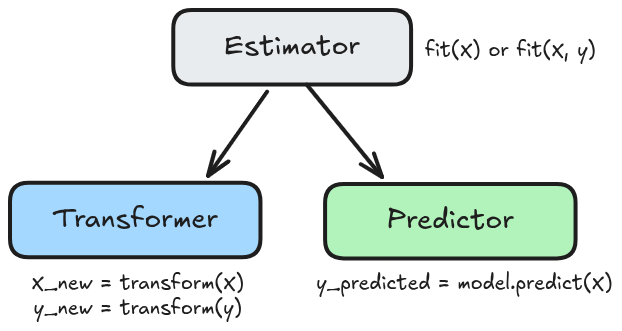

هو **الخط** أو **المسار** السابق لدخول البيانات إلى خوارزمية التعلم. وذلك ليتم ضبط النموذج مع جميع المعالجات القبليَّة له جُملَةً واحدة؛ فالتغيير فيها أو في عوامل النموذج، كلاهُما يؤثر في نتيجة التنبؤ.

أولها: **الإجمال (عكس التفصيل):** فبدلاً من كتابة كود طويل لكل خطوة كهذا:

```python
step_1 = SimpleImputer()
X_train = step_1.fit_transform(X_train)

step_2 = StandardScaler()
X_train = step_2.fit_transform(X_train)

model = SGDRegressor()
model.fit(X_train, y_train)
```

.. المسار يجمع الخطوات في سلسلة واحدة، يتم فيها تحديد كل خطوة وتسميتها، على النحو التالي

```python
pipe = Pipeline(
	steps=[
		('imputer', SimpleImputer()),
		('scaler', StandardScaler()),
		('regressor', SGDRegressor()),
	]
)
```

.. فيكفي استدعاء `fit()` مرة واحدة على بياناتك لملاءمة سلسلة الخطوات جملةً واحدة:

```python
pipe.fit(X_train, y_train)
```

أما `transform()` فيتم استدعاؤها عند الحاجة: عند التنبؤ أو التقييم.

وكذلك عند التنبؤ، لا حاجة لمعرفة تفاصيل التحويلات ثم كتابتها واحدة واحدة، بل هي محفوظة كقطعة متكاملة:

```python
pipe.predict(X_new)
```

وكذلك التقييم:

```python
pipe.score(X_test, y_test)
```

## ما هي فلسفة مكونات خط المعالجة (Pipeline)؟

نتعلم في هذا الدرس: الانتقال من النموذج إلى **خط المعالجة** ([Pipeline](https://scikit-learn.org/stable/modules/generated/sklearn.pipeline.Pipeline.html))، حيث جميع خطواته هي أحد أمرين لا ثالث لهما. ففي مكتبة sklearn تم تسمية الوحدة في مسار المعالجة باسم **المقدِّر ([Estimator](https://scikit-learn.org/stable/glossary.html#term-estimator))**، وهي إما:

1. **محوِّل ([Transformer](https://scikit-learn.org/stable/glossary.html#term-transformer))**:
	- يُحصي مقادير من البيانات: `.fit(X)`
	- يُحوِّل البيانات بناءً على المقادير المحسوبة: `.transform(X)`
2. **متنبئ ([Predictor](https://scikit-learn.org/stable/glossary.html#term-predictor))**:
	- يلائم البيانات: `.fit(X, y)`
	- يتنبأ بالنتائج: `.predict(X)`
	- يُقيَّم: `.score(X, y)`



لنفصّل الأمر:

### المحوّل (Transformer)

ملاحظة: قد تضيف المحولات أعمدة أو تزيلها. لكنها لا تضيف بيانات جديدة (صفوف) أو تزيلها.

وإليك أمثلة للمحولات وعمل كلا الإجرائين فيها:

| **المحول** | **التقدير: `fit`** | **التحويل: `transform`** |
| ---: | ---: | ---: |
| [`SimpleImputer('mean')`](https://scikit-learn.org/stable/modules/generated/sklearn.impute.SimpleImputer.html) | يحصي المتوسط. | يملأ الفراغات بالمتوسط. |
| [`StandardScaler`](https://scikit-learn.org/stable/modules/generated/sklearn.preprocessing.StandardScaler.html) | يحسب المتوسط والانحراف المعياري. | يحول البيانات لتكون على المقياس الطبيعي. |
| [`OneHotEncoder`](https://scikit-learn.org/stable/modules/generated/sklearn.preprocessing.OneHotEncoder.html) | يحدد الصفات الفريدة ويخصص ترميزاً أحاديًّا لكل منها. | يطبق الترميزات على العينات ليحولها إلى أعمدة أحادية. |
| [`OrdinalEncoder`](https://scikit-learn.org/stable/modules/generated/sklearn.preprocessing.OrdinalEncoder.html) | يحدد الصفات الفريدة ويخصص لها ترتيباً عدديًا. | يطبق الترميز ويحول الصفات إلى قيم عددية مرتبة. |

###  المتنبئ (Predictor)

مثل النماذج: `LinearRegression`, `SGDRegressor`, `KNeighborsClassifier`

فأما إجراءاته فهي:

1. **التقدير**: `fit(X)` وهي ملاءمة النموذج للبيانات وفق خوارزمية التعلم الآلي المحددة. وهنا يحصل التعليم / التدريب.
2. **التنبؤ**: `predict(X)` تطبّق النموذج على الحالات الجديدة فقط.

### الهيكل التنظيمي للمكتبة

وبهذا يتبيَّنُ لك كيف تم تقسيم المكتبة على نحو هذا الشكل:

```python
"""
sklearn/
├── preprocessing/       <-- (Transformers)
│   ├── StandardScaler
│   ├── OneHotEncoder
│   └── ...
├── impute/              <-- (Transformers)
│   ├── SimpleImputer
│   └── ...
├── linear_model/        <-- (Predictors)
│   ├── LinearRegression
	├── SGDRegressor
│   └── ...
├── neighbors/           <-- (Predictors)
│   ├── KNeighborsClassifier
│   └── ...
├── ensemble/            <-- (Predictors)
│   ├── RandomForestClassifier
│   └── ...
└── pipeline/            <-- (The Glue)
    └── Pipeline
"""
```

حيث يتم استيرادها على هذا النحو:

```python
from sklearn.pipeline import Pipeline
from sklearn.preprocessing import StandardScaler
from sklearn.linear_model import LinearRegression
```

### الخلاصة

| العنصر | الإجراء | الغرض |
| ---: | ---: | ---: |
| [المُقدِّر (Estimator)]() | [`fit()`](https://scikit-learn.org/stable/glossary.html#term-fit) | لملاءمة المعاملات من البيانات. |
| [المُحوِّل (Transformer)](https://scikit-learn.org/stable/glossary.html#term-transformer) | [`transform()`](https://scikit-learn.org/stable/glossary.html#term-transform) | لاستخدام المعاملات التي تم تعلمها أو حسابها على البيانات. |
| [المُتنبِّئ (Predictor)](https://scikit-learn.org/stable/glossary.html#term-predictor) | [`predict()`](https://scikit-learn.org/stable/glossary.html#term-predict) | لاستخدام المعاملات التي تم تعلمها للتنبؤ. |
| المُتنبِّئ (Predictor) | [`score()`](https://scikit-learn.org/stable/glossary.html#term-score) | لتقييم جودة الملاءمة (الأعلى أفضل). |

---

- المصدر: [توثيق scikit-learn الرسمي لتصميم الواجهة البرمجية](https://scikit-learn.org/stable/developers/develop.html)
- [مثال: بناء خط معالجة](./05_pipeline_example.ipynb)
- [تمرين: بناء خط معالجة](./exercises/03_pipeline_ex.ipynb)
