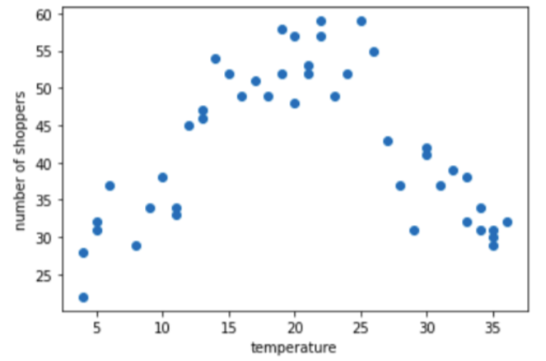
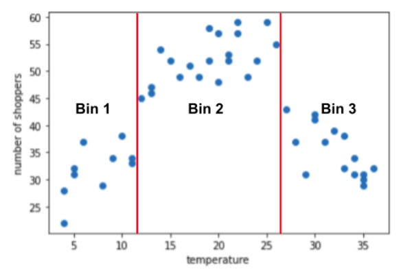

**عملية تسوية الخصائص** (Feature Scaling) **توحِّد قيَم المتغيرات المتفاوتة لتكون على مقياس مماثل**.

والحاجة إليها ماسَّة لأنها تعطي المعنى التالي:

- مثل: الوزن `100kg` والطول `100m`، لا يستويان من حيث النسبة إلى القيم المحيطة لنفس المتغير.
- كذلك: مبلغ `10` ملايين دولار في أسعار المنازل يعد قيمة كبيرة. وبالقياس، فإن الرقم `10` في عدد الغرف يعد قيمة كبيرة أيضًا.
- وعكسه: مبلغ `30` آلاف دولار بالنسبة لسعر منزل يعد قيمة صغيرة. وبالقياس فإن القيمة `3` في عدد الغرف يعد قيمة صغيرة أيضًأ.

## أهميتها

تظهر أهمية ذلك في:

### في تفسير قوة أثر المتغيرات نفسها

إذْ لا يُمكن تفسير قوَّة تأثير المتغيرات بالنظر للمعاملات: $w_1, w_2, \dots$ حين تكون قيم المتغيرات نفسها متفاوتة. لكن حين نضعها على نفس المقياس، تكون قيمة المعامل بعد التدريب ممثلة لأهميَّة المتغير الذي يصحبه العامل.

### في خوارزمية النزول التدريجي (SGD)

إذْ تتأثر الخطوة -في اتجاه تقليل الخسارة- بتفاوت قيَم المتغيرات.

### وفي خوارزمية أقرب جيران (KNN)

إذْ تعتمد على حساب المسافة بين متغيرات متفاوتة القيَم. كما هو موضح في [الصورة التالية](https://scikit-learn.org/stable/auto_examples/preprocessing/plot_scaling_importance.html#effect-of-rescaling-on-a-k-neighbors-models):

والسبب في أن أماكن النقاط لا يتغير هو أن الرسم يُجري عمليَّة تسوية أصلاً؛ لتظهر جميع النقاط.

وقد لا تتأثر بعض الخوارزميات بتفاوُت القيَم لكنه أيضًا لا يضرها، مثل: شجرة القرارة (Decision Tree).

للمزيد راجع: [أهميَّة التسوية](https://scikit-learn.org/stable/auto_examples/preprocessing/plot_scaling_importance.html).

## كيفياتها

وهناك طبيعتان لطرق **التسوية**: خطية ولا خطيَّة.

### أولاً: **الخطية**

وهي لا تغيِّرُ نسبة ما بين القيَم نفسها.

ولها طريقتان معروفتان:

#### الطريقة الأولى: تقييس النطاق بين الصفر والواحد

في المكتبة ([`MinMaxScaler`](https://scikit-learn.org/stable/modules/generated/sklearn.preprocessing.MinMaxScaler.html))، وتعني تحويل القيم من نطاقها الأصلي إلى نطاق ثابت:

- عادةً من 0 إلى 1
- أو من -1 إلى +1

**الاستخدام**: يكون التقييس الخطي فعالاً عند تحقق شروط، نمثل لها بعمر الإنسان:

1.  **حدود مستقرة:** القيم الدنيا والقصوى للميزة تظل ثابتة (عادةً من 0 إلى 100 عام)
2.  **تشبع النطاق:** يوجد عدد جيد من البيانات لجميع الفئات العمرية.
3. **قلة القيم المتطرفة**: نسبة ضئيلة جداً تعيش بعد 100 عام.

#### الطريقة الثانية: تقييس النطاق بالمقياس الطبيعي

في المكتبة ([`StandardScaler`](https://scikit-learn.org/stable/modules/generated/sklearn.preprocessing.StandardScaler.html))، إذْ يتم تنصيف القيَم حوْلَ الصفر (بطرحها من المتوسط)، وتكون القيَم بين ثلاث درجات بالنسبة للانحراف المعياري (بقسمتها عليه).

يتم حساب الدرجة المعيارية $z$ لعينة $x$ كما يلي:

$$
z = \frac{x - \mu}{s}
$$

حيث تمثل $\mu$ و $s$ المتوسط الحسابي والانحراف المعياري لعينات التدريب، على التوالي.

مناسب عندما  تتبع البيانات **التوزيع الطبيعي** أو قريبًا منه.

**التقليم (Clipping)** هي عملية استبعاد القيَم المتطرفة (Outliers) بهدف التخفيف من أثرها السلبي على أداء النموذج. قد يتحقق ذلك بإزالة أي قيم تقع خارج:

- نطاق -3 إلى +3 درجات معيارية
- أو ما فوق 99% من البيانات وما دون 1% منها

**مثال:** لنفترض وجود مجموعة بيانات بميزة تُسمى `roomsPerPerson` (عدد الغرف لكل شخص). في حين أن أغلب القيم تتبع التوزيع الطبيعي، قد توجد بضع قيم متطرفة لمنازل تحتوي على عدد هائل من الغرف لكل فرد.

### ثانيًا: **لا خطيَّة**

إذْ تغيِّرُ نسبة ما بين القيَم. ومنها:

#### الطريقة الأولى: تقييس لوغارتمي (Log Scaling)

فهي تحوِّل التوزيع غير الطبيعي، المنحاز إلى أحد الجانبين -الموجب أو السالب- إلى **توزيع طبيعي** (Normal Distribution) باستعمال اللوغاريتم الطبيعي ($\ln$). كما هو موضح في الصورة التالية:

 

مفيدة للبيانات التي تتبع **توزيع قانون القوة (Power Law Distribution)**، والذي يتميز بوجود قلة من نقاط البيانات ذات القيم العالية جداً وكثير من النقاط ذات القيم المنخفضة.

- **مثال 1:** عدد قليل من الأفلام يشتهر بقوَّة، بينما الغالبية العظمى تحصل على القليل من الانتباه.
- **مثال 2:** معظم الكتب تبيع نسخاً قليلة جداً، بينما تحقق كتب (الأكثر مبيعاً) الملايين.

انظر [تحويل قيمة الهدف](https://scikit-learn.org/stable/auto_examples/compose/plot_transformed_target.html).

**التقسيم ([Binning](https://scikit-learn.org/stable/modules/preprocessing.html#discretization))** هو أحد أساليب **هندسة الميزات** (Feature Engineering) التي تتضمن تجميع القيم الرقمية في فئات أو حاويات (Bins) منفصلة.

* **مثال:** عدد المتسوقين (زوار المتجر) مقابل درجة الحرارة (حالة الطقس).

يشير الرسم البياني إلى وجود ثلاث مجموعات (Clusters) ضمن النطاقات الفرعية التالية:

* **الفئة 1:** نطاق درجة الحرارة من 4 إلى 11.
* **الفئة 2:** نطاق درجة الحرارة من 12 إلى 26.
* **الفئة 3:** نطاق درجة الحرارة من 27 إلى 36.

يعتبر التقسيم بديلاً جيدًا لعمليات **التقييس** (Scaling) أو **التقليم** (Clipping) عند تحقق أي من الشرطين التاليين:

1.  **ضعف العلاقة الخطية**: عندما تكون العلاقة الخطية الإجمالية بين الميزة والوسم (Label) ضعيفة أو منعدمة. (يوضح المثال أعلاه حالة "لا خطية": حيث يصعد المنحنى ثم يهبط؛ أي أنه منحنى وليس خطاً مستقيماً).
2.  **تكتل البيانات**: عندما تكون قيم الميزة متجمعة في كتل أو مجموعات واضحة.

---

[التالي](./categorical_feature_encoding.ipynb): **كيف نُعمِل المتغيرات الوصفية في النموذج؟**