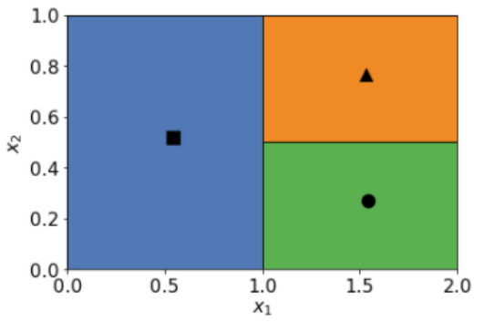
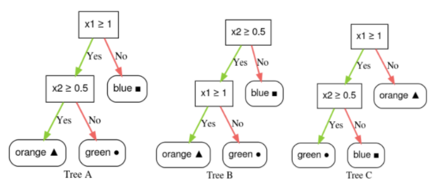

A **Decision Tree** is grown by dividing the data into smaller and smaller subsets based on specific conditions, until each subset is relatively pure.

Consider the following prediction map on two features x1 and x2:

Which of the following decision trees match the prediction map?

Hint: leaf nodes and regions correspond.
