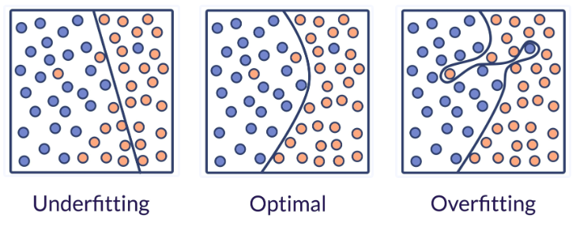
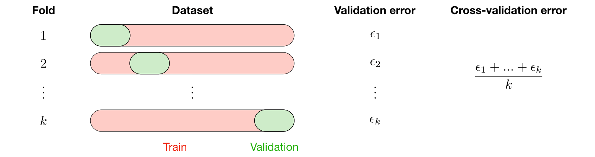
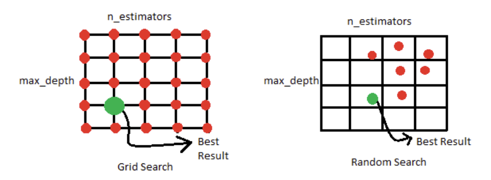
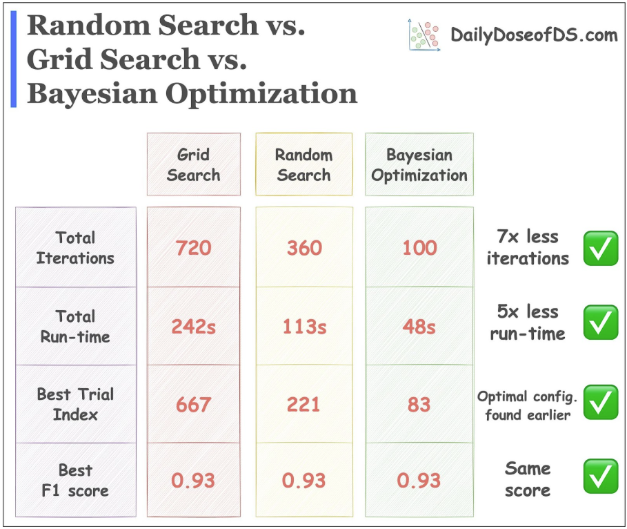

## Choosing the right ML algorithm for your data

Often the hardest part of solving a machine learning problem can be finding the right estimator for the job. Different estimators are better suited for different types of data and different problems.

See: [Scikit-learn > User Guide > 13. Choosing the right estimator](https://scikit-learn.org/stable/machine_learning_map.html) for the scikit-learn algorithm cheat sheet.

## how to assess our model's performance?

**Loss and Error**: These are objective functions optimized by the machine learning algorithm during training. The primary goal of the model is to minimize this value (e.g., Mean Squared Error for regression, or Log Loss for classification) to "learn" the patterns in the data.

**Metric and Score**: These are human-interpretable measures used to evaluate the model's final performance from a practical or business perspective. While the model trains by minimizing loss, we judge its overall success and compare it against other models using metrics (e.g., Accuracy, R-squared, Precision, or Recall).

In scikit-learn:

- **Score**: higher is better.
- **Error**: lower is better.

## why do we have a held-out set for testing?

Splitting a dataset into **training** and **test** sets is the primary method used to estimate how a model will perform in the real world.

In scikit-learn a random split into training and test sets can be quickly computed with the [`train_test_split`](https://scikit-learn.org/stable/modules/generated/sklearn.model_selection.train_test_split.html#sklearn.model_selection.train_test_split "sklearn.model_selection.train_test_split") helper function. Let’s load the iris data set to fit a linear support vector machine on it:

```python
from sklearn import datasets

X, y = datasets.load_iris(return_X_y=True)
```

We can now quickly sample a training set while holding out 40% of the data for testing (evaluating) our classifier:

```python
from sklearn.model_selection import train_test_split

X_train, X_test, y_train, y_test = train_test_split(
    X, y,
    test_size=0.2,
    random_state=123,
)
```

```{mermaid}
flowchart TD
    A[Dataset] -- "random 80%" --> B[Training Set]
    B --> B1
    B --> B2
    B1[X_train]
    B2[y_train]

    A -- "random 20%" --> C[Testing Set]
    C --> C1
    C --> C2
    C1[X_test]
    C2[y_test]
```

Train and test the model:

```python
from sklearn.linear_model import LogisticRegression

clf = LogisticRegression(C=1) # Specify the model

clf.fit(X_train, y_train) # Train
clf.score(X_test, y_test) # Test
```

In machine learning, the fundamental goal is **generalization**: the ability of a model to make accurate predictions on new, unseen data, rather than just "memorizing" the data it has already seen.

Using the same data for both training and evaluation creates a **circular dependency**. It is mathematically dishonest to test a model on the same data used to build it because the model's error rate will be optimistically biased.

A test set provides an **unbiased estimate** of the model's performance (loss, accuracy, precision, etc.) on new observations.

### What is the proportion of the splits?

According to Andrew Ng, proportions of splits are based on the size of the data:

- Small data (thousands of data points) could be 70:20:10
- Big data (millions of data points) could be 98:1:1
## Inconsistent Pre-processing

scikit-learn provides a library of [Dataset transformations](https://scikit-learn.org/stable/data_transforms.html#data-transforms), which may clean (see [Preprocessing data](https://scikit-learn.org/stable/modules/preprocessing.html#preprocessing)), reduce (see [Unsupervised dimensionality reduction](https://scikit-learn.org/stable/modules/unsupervised_reduction.html#data-reduction)), expand (see [Kernel Approximation](https://scikit-learn.org/stable/modules/kernel_approximation.html#kernel-approximation)) or generate (see [Feature extraction](https://scikit-learn.org/stable/modules/feature_extraction.html#feature-extraction)) feature representations. If these data transforms are used when training a model, they also must be used on subsequent datasets, whether it’s test data or data in a production system. Otherwise, the feature space will change, and the model will not be able to perform effectively.

For the following example, let’s create a synthetic dataset with a single feature:

```python
from sklearn.datasets import make_regression
from sklearn.model_selection import train_test_split

random_state = 42

X, y = make_regression(random_state=random_state, n_features=1, noise=1)

X_train, X_test, y_train, y_test = train_test_split(
    X,
    y,
    test_size=0.4,
    random_state=random_state
)
```

### Wrong

The train dataset is scaled, but not the test dataset, so model performance on the test dataset is worse than expected:

```python
from sklearn.metrics import mean_squared_error
from sklearn.linear_model import LinearRegression
from sklearn.preprocessing import StandardScaler

scaler = StandardScaler()
X_train_transformed = scaler.fit_transform(X_train)

model = LinearRegression()
model.fit(X_train_transformed, y_train)
model.score(X_test, y_test)
```

### Right

Instead of passing the non-transformed `X_test` to `predict`, we should transform the test data, the same way we transformed the training data:

X_test_transformed = scaler.transform(X_test)
model.score(X_test_transformed, y_test)


Alternatively, we recommend using a [`Pipeline`](https://scikit-learn.org/stable/modules/generated/sklearn.pipeline.Pipeline.html#sklearn.pipeline.Pipeline "sklearn.pipeline.Pipeline"), which makes it easier to chain transformations with estimators, and reduces the possibility of forgetting a transformation:

```python
from sklearn.pipeline import Pipeline

model = Pipeline([
    ('scaler', StandardScaler()),
    ('regressor', LinearRegression())
])
model.fit(X_train, y_train)
model.score(X_test, y_test)
```

Pipelines also help avoiding another common pitfall: leaking the test data into the training data.

## Data Leakage

**Data leakage** occurs when information that would not be available at prediction time is used when building the model. This results in overly optimistic performance estimates.

**Test data should never be used to make choices about the model**. While this may sound obvious, this is easy to miss in some cases, for example when applying certain pre-processing steps.

For example: when you compute statistical parameters (such as the mean and variance for a `StandardScaler`) using the entire dataset, the test data's distribution directly influences the training data. The model therefore receives artificially early access to the test set's characteristics, leading to overly optimistic performance metrics during evaluation that will not hold up in production.

### Wrong

In this flawed approach, the scaler is fitted to the global dataset `X`. The test set's data points are mathematically factored into the scaling logic before the split ever occurs:

```python
# Incorrect: Fitting the scaler on the entire dataset before splitting
scaler = StandardScaler()
X_transformed = scaler.fit_transform(X)

# The test set information has now "leaked" into the training set
X_train, X_test, y_train, y_test = train_test_split(
    X_transformed,
    y,
    test_size=0.4,
    random_state=random_state
)

model = LinearRegression()
model.fit(X_train, y_train)
model.score(X_test, y_test)
```

### Right

To maintain a strict boundary between training and testing data, the dataset must be split _before_ any transformation parameters are calculated. The scaler should only be fitted to the training set.

While you can execute this manually by splitting first and then calling `fit_transform` on `X_train` and `transform` on `X_test`, a `Pipeline` enforces this separation automatically. This is especially critical when using cross-validation, where the train and test splits change with every fold:

```python
from sklearn.model_selection import cross_val_score

# Correct: The raw data is split. 
X_train, X_test, y_train, y_test = train_test_split(
    X,
    y,
    test_size=0.4,
    random_state=random_state
)

model = Pipeline([
    ('scaler', StandardScaler()),
    ('regressor', LinearRegression())
])

# The Pipeline ensures that the StandardScaler is fitted strictly on the 
# training subsets during each fold of the cross-validation process.
scores = cross_val_score(model, X_train, y_train, cv=5)

# Finally, evaluate on the isolated test set
model.fit(X_train, y_train)
model.score(X_test, y_test)
```

::: {.callout-warning}

This risk of leakage is relevant with almost all transformations in scikit-learn, including (but not limited to) [`StandardScaler`](https://scikit-learn.org/stable/modules/generated/sklearn.preprocessing.StandardScaler.html#sklearn.preprocessing.StandardScaler "sklearn.preprocessing.StandardScaler"), [`SimpleImputer`](https://scikit-learn.org/stable/modules/generated/sklearn.impute.SimpleImputer.html#sklearn.impute.SimpleImputer "sklearn.impute.SimpleImputer"), and [`PCA`](https://scikit-learn.org/stable/modules/generated/sklearn.decomposition.PCA.html#sklearn.decomposition.PCA "sklearn.decomposition.PCA").

:::

### How to avoid data leakage

Below are some tips on avoiding data leakage:

- Always split the data into train and test subsets first, particularly before any preprocessing steps.
- Never include test data when using the `fit` and `fit_transform` methods. Using all the data, e.g., `fit(X)`, can result in overly optimistic scores.
  - Conversely, the `transform` method should be used on both train and test subsets as the same preprocessing should be applied to all the data. This can be achieved by using `fit_transform` on the train subset and `transform` on the test subset.

Note: [**Pipeline**](https://scikit-learn.org/stable/modules/compose.html#pipeline) is a great way to prevent data leakage as it ensures that the appropriate method is performed on the correct data subset. The pipeline is ideal for use in **cross-validation** and **hyper-parameter tuning** functions.


## how do we know our model is better than a guess?

When doing supervised learning, a simple sanity check consists of comparing one’s estimator against simple rules of thumb. [`DummyClassifier`](https://scikit-learn.org/stable/modules/generated/sklearn.dummy.DummyClassifier.html#sklearn.dummy.DummyClassifier "sklearn.dummy.DummyClassifier") implements several such simple strategies for classification:

- `constant` always predicts a constant label that is provided by the user.
- `most_frequent` always predicts the most frequent label in the training set.
- `stratified` generates random predictions by respecting the training set class distribution.

Note that with all these strategies, the `predict` method completely ignores the input data!

To illustrate [`DummyClassifier`](https://scikit-learn.org/stable/modules/generated/sklearn.dummy.DummyClassifier.html#sklearn.dummy.DummyClassifier "sklearn.dummy.DummyClassifier"), first let’s create an imbalanced dataset:

```python
from sklearn.dummy import DummyClassifier

dummy_clf = DummyClassifier(strategy="most_frequent")
dummy_clf.fit(X_train, y_train)
```

Next, let’s compare the accuracy of `LogisticRegression` and `most_frequent`:

```python
print('Dummy Classifier Score:', dummy_clf.score(X_test, y_test))
print('Logistic Regressino Score:', clf.score(X_test, y_test))
```

More generally, when the accuracy of a classifier is too close to random, it probably means that something went wrong: features are not helpful, a hyperparameter is not correctly tuned, the classifier is suffering from class imbalance, etc…

[`DummyRegressor`](https://scikit-learn.org/stable/modules/generated/sklearn.dummy.DummyRegressor.html#sklearn.dummy.DummyRegressor "sklearn.dummy.DummyRegressor") also implements four simple rules of thumb for regression:

- `mean` always predicts the mean of the training targets.
- `median` always predicts the median of the training targets.
- `quantile` always predicts a user provided quantile of the training targets.
- `constant` always predicts a constant value that is provided by the user.

In all these strategies,  the `predict` method completely ignores the input data.

## how do we avoid under-fitting and over-fitting?



We evaluate quantitatively overfitting / underfitting by using **cross-validation** (explained below). We calculate the mean squared error (MSE) on the **validation set**, the higher, the less likely the model generalizes correctly from the training data.


[See Code](https://scikit-learn.org/stable/auto_examples/model_selection/plot_underfitting_overfitting.html).

Here is a flowchart of typical cross validation workflow in model training. The best parameters can be determined by [grid search](https://scikit-learn.org/stable/modules/grid_search.html#grid-search) techniques.


### Stability of the cross-validation estimates

When doing a single train-test split we don't give any indication regarding the robustness of the evaluation of our predictive model: in particular, if the test set is small, this estimate of the testing error will be unstable and wouldn't reflect the "true error rate" we would have observed with the same model on an unlimited amount of test data.

For instance, we could have been lucky when we did our random split of our limited dataset and isolated some of the easiest cases to predict in the testing set just by chance: the estimation of the testing error would be overly optimistic, in this case.

**Cross-validation (CV)** allows estimating the robustness of a predictive model by repeating the splitting procedure. It will give several training and testing errors and thus some **estimate of the variability of the model generalization performance**.

There are [different cross-validation strategies](https://scikit-learn.org/stable/modules/cross_validation.html#cross-validation-iterators), two of which are summed up in the table below:

| **k-fold**                                                                                     | **Leave-p-out**                                                                                                      |
| ---------------------------------------------------------------------------------------------- | -------------------------------------------------------------------------------------------------------------------- |
| • Training on $k−1$ folds and assessment on the remaining one  <br>• Generally $k=5$ or $k=10$ | • Training on $n−p$ observations and assessment on the $p$ remaining ones  <br>• Case $p=1$ is called "leave-one-out" |

The most commonly used method is called $k$-fold cross-validation and splits the training data into $k$ folds to validate the model on one fold while training the model on the $k−1$ other folds, all of this $k$ times. The error is then averaged over the $k$ folds and is named **cross-validation error**.

.

**Note**: A test set should still be held out for final evaluation.

### Computing cross-validated metrics

The simplest way to use cross-validation is to call the [`cross_val_score`](https://scikit-learn.org/stable/modules/generated/sklearn.model_selection.cross_val_score.html#sklearn.model_selection.cross_val_score "sklearn.model_selection.cross_val_score") helper function on the estimator and the dataset.

The following example demonstrates how to estimate the accuracy of a linear kernel support vector machine on the iris dataset by splitting the data, fitting a model and computing the score 5 consecutive times (with different splits each time):

```python
from sklearn.model_selection import cross_val_score

clf = svm.SVC(kernel='linear', C=1, random_state=42)
scores = cross_val_score(clf, X, y, cv=5)
scores
```

### Validation Curve

[Source: Cross-validation: evaluating estimator performance| Scikit-learn](https://scikit-learn.org/stable/modules/cross_validation.html)

Sometimes it is helpful to plot the influence of a single hyperparameter on the training score and the validation score to find out whether the estimator is overfitting or underfitting for some hyperparameter values.

```python
from sklearn.datasets import load_iris
from sklearn.model_selection import ValidationCurveDisplay
from sklearn.svm import SVC
from sklearn.utils import shuffle

X, y = load_iris(return_X_y=True)
X, y = shuffle(X, y, random_state=0)

ValidationCurveDisplay.from_estimator(
   SVC(kernel="linear"),
   X, y,
   param_name="C",
   param_range=np.logspace(-7, 3, 10)
)
```


- If the training score and the validation score are both low, the estimator will be underfitting.
- If the training score is high and the validation score is low, the estimator is overfitting.
- Otherwise it is working very well (validation score is high).

Note: a low training score and a high validation score is usually not possible. How can one achieve worse on seen examples vs unseen ones?

Source: [3.5.1. Validation curve](https://scikit-learn.org/stable/modules/learning_curve.html#validation-curve).


## Model scalability: can the model learn from more data?

**Learning curves** show the effect of adding more training samples.


Left: naive Bayes classifier. Its shape can be found in more complex datasets very often:

- the training score is very high when using few samples for training and decreases when increasing the number of samples
- whereas the test score is very low at the beginning and then increases when adding samples.
- the training and test scores become more realistic when all the samples are used for training.

Right: SVM classifier with RBF kernel.

- The training score remains high regardless of the size of the training set.
- On the other hand, the test score increases with the size of the training dataset.
- Indeed, it increases up to a point where it reaches a plateau.

Observing such a *plateau* is an indication that **it might not be useful to acquire new data to train the model** since the generalization performance of the model will not increase anymore.

Read more: [Plotting Learning Curves and Checking Models’ Scalability](https://scikit-learn.org/stable/auto_examples/model_selection/plot_learning_curve.html).

## Tuning the hyper-parameters of an estimator

**Hyper-parameters** are parameters that are not directly learnt within estimators (unlike: $w_1, w_2, \dots w_n$ and the bias term: $b$). In scikit-learn they are passed as arguments to the constructor of the estimator classes. Examples include:

- for Linear Regression: the degree of the polynomial
- for Logistic Regression: the regularization strength `C`
- for Decision Trees: `max_depth`, `min_samples_leaf`
- for Support Vector Machine: `C`, `kernel` and `gamma`

It is possible and **recommended to search the hyper-parameter space for the best** [**cross validation**](https://scikit-learn.org/stable/modules/cross_validation.html#cross-validation) **score**.

Any parameter provided when constructing an estimator may be optimized in this manner. Specifically, to find the names and current values for all parameters for a given estimator, use:

```python
estimator.get_params()
```

A search consists of:

- an estimator (regressor or classifier such as `sklearn.svm.SVC()`);
- a parameter space;
- a cross-validation scheme; and
- a [score function](https://scikit-learn.org/stable/modules/grid_search.html#gridsearch-scoring).
- a search method (Hyper-parameter tuning methods)

### Hyper-parameter tuning methods

`Scikit-learn` provides tools to automatically find the best parameter combinations (via cross-validation). Mainly:

1. [`GridSearchCV`](https://scikit-learn.org/stable/modules/generated/sklearn.model_selection.GridSearchCV.html#sklearn.model_selection.GridSearchCV) exhaustively considers all parameter combinations
2. [`RandomizedSearchCV`](https://scikit-learn.org/stable/modules/generated/sklearn.model_selection.RandomizedSearchCV.html#sklearn.model_selection.RandomizedSearchCV) samples a given number of candidates from a parameter space with a specified distribution.

Note: **CV** indicates that they will search using cross-validation.

Example: decision trees have `n_estimators` and `max_depth`:



For more hyper-parameters, imagine more dimensions (not just 2D grid).

In the following example, we randomly search over the parameter space of a random forest with a [`RandomizedSearchCV`](https://scikit-learn.org/stable/modules/generated/sklearn.model_selection.RandomizedSearchCV.html#sklearn.model_selection.RandomizedSearchCV) object.

```python
from sklearn.datasets import make_regression
from sklearn.ensemble import RandomForestRegressor
from sklearn.model_selection import RandomizedSearchCV
from sklearn.model_selection import train_test_split
from scipy.stats import randint

# create a synthetic dataset
X, y = make_regression(
    n_samples=20640,
    n_features=8,
    noise=0.1,
    random_state=0
)

X_train, X_test, y_train, y_test = train_test_split(
    X, y, random_state=0
)

# define the parameter space that will be searched over
param_distributions = {
    'n_estimators': randint(1, 5),
    'max_depth': randint(5, 10)
}
# now create a searchCV object and fit it to the data
search = RandomizedSearchCV(
    estimator=RandomForestRegressor(random_state=0),
    n_iter=5,
    param_distributions=param_distributions,
    random_state=0
)

search.fit(X_train, y_train)
```

When the search is over, the [`RandomizedSearchCV`](https://scikit-learn.org/stable/modules/generated/sklearn.model_selection.RandomizedSearchCV.html#sklearn.model_selection.RandomizedSearchCV) behaves as a [`RandomForestRegressor`](https://scikit-learn.org/stable/modules/generated/sklearn.ensemble.RandomForestRegressor.html#sklearn.ensemble.RandomForestRegressor) that has been fitted with the best set of parameters. Read more in the [User Guide](https://scikit-learn.org/stable/modules/grid_search.html#grid-search):

```python
search.best_params_
```

the search object now acts like a normal random forest estimator with `max_depth=9` and `n_estimators=4`:

```python
search.score(X_test, y_test)
```

[`GridSearchCV`](https://scikit-learn.org/stable/modules/generated/sklearn.model_selection.GridSearchCV.html#sklearn.model_selection.GridSearchCV "sklearn.model_selection.GridSearchCV") and [`RandomizedSearchCV`](https://scikit-learn.org/stable/modules/generated/sklearn.model_selection.RandomizedSearchCV.html#sklearn.model_selection.RandomizedSearchCV "sklearn.model_selection.RandomizedSearchCV") allow searching over parameters of composite or nested estimators such as [`Pipeline`](https://scikit-learn.org/stable/modules/generated/sklearn.pipeline.Pipeline.html#sklearn.pipeline.Pipeline "sklearn.pipeline.Pipeline"), [`ColumnTransformer`](https://scikit-learn.org/stable/modules/generated/sklearn.compose.ColumnTransformer.html#sklearn.compose.ColumnTransformer "sklearn.compose.ColumnTransformer"), [`VotingClassifier`](https://scikit-learn.org/stable/modules/generated/sklearn.ensemble.VotingClassifier.html#sklearn.ensemble.VotingClassifier "sklearn.ensemble.VotingClassifier") or [`CalibratedClassifierCV`](https://scikit-learn.org/stable/modules/generated/sklearn.calibration.CalibratedClassifierCV.html#sklearn.calibration.CalibratedClassifierCV "sklearn.calibration.CalibratedClassifierCV") using a dedicated `<estimator>__<parameter>` syntax:

```python
from sklearn.pipeline import Pipeline
from sklearn.preprocessing import StandardScaler
from sklearn.ensemble import RandomForestClassifier
from sklearn.model_selection import GridSearchCV
from sklearn.datasets import make_moons

# 1. Prepare Data
X, y = make_moons(n_samples=500, noise=0.3, random_state=42)

# 2. Define the Pipeline
# We treat the scaler and the classifier as a single "mega-model."
pipe = Pipeline([
    ('scaler', StandardScaler()),
    ('model', RandomForestClassifier())
])

# 3. Define the Search Grid
# Syntax: <step_name>__<parameter_name>
param_grid = {
    'model__n_estimators': [50, 100],
    'model__max_depth': [3, 5, None]
}

# 4. Run the Grid Search
# This automatically scales the data and trains the model for every combination.
search = GridSearchCV(pipe, param_grid, cv=5)
search.fit(X, y)

print(f"Best settings found: {search.best_params_}")
print(f"Accuracy of best model: {search.best_score_:.2%}")
```

Refere to [Pipeline: chaining estimators](https://scikit-learn.org/stable/modules/compose.html#pipeline) for more.

### Bayesian Optimization

While Grid and Random Search treat each trial as an independent event, **Bayesian Optimization** treats the search as an optimization problem itself. It constructs a mathematical model of the "objective function" (the relationship between your hyperparameters and the model's accuracy) to find the best values with as few trials as possible.

#### Key Components:

- **Surrogate Model:** Since training a machine learning model is expensive, we build a simpler, probabilistic model (often a **Gaussian Process**) to act as a stand-in. This model estimates the expected performance and the level of uncertainty for any given set of hyperparameters.
    
- **Acquisition Function:** This is a logic layer that uses the surrogate model to decide the next point to sample. it balances **Exploitation** (searching where the model predicts high performance) and **Exploration** (searching where the model is uncertain).
    
- **Iterative Update:** After each trial, the actual result is fed back into the surrogate model to update its "beliefs," refining its accuracy for the next trial.
    

**Code Snippet (using `scikit-optimize`):**

```python
from skopt import BayesSearchCV
from sklearn.linear_model import SGDClassifier
from sklearn.datasets import load_iris
from sklearn.model_selection import train_test_split

# Load data
X, y = load_iris(return_X_y=True)
X_train, X_test, y_train, y_test = train_test_split(X, y, test_size=0.2)

# Define the search space
# SGD is sensitive to 'alpha' (regularization) and 'loss'
search_space = {
    'alpha': (1e-6, 1e-1, 'log-uniform'),
    'loss': ['hinge', 'log_loss', 'modified_huber'],
    'penalty': ['l2', 'l1', 'elasticnet']
}

opt = BayesSearchCV(
    SGDClassifier(),    
    search_space,
    n_iter=25,
    cv=5
)

opt.fit(X_train, y_train)
print(f"Best Score: {opt.best_score_}")
print(f"Best Parameters: {opt.best_params_}")
```



The results look really promising. Bayesian optimization leads the model to the same F1 score but:

1. takes 7x fewer iterations
2. runs 5x faster
3. reaches the optimal configuration earlier

### Model-specific hyper-parameter tuning

Some models can fit data for a range of values of some parameter almost as efficiently as fitting the estimator for a single value of the parameter. This feature can be leveraged to perform a more **efficient cross-validation** used for model selection of this parameter.

See: [3.2.5.1. Model specific cross-validation](https://scikit-learn.org/stable/modules/grid_search.html#model-specific-cross-validation) for a list of those models.

