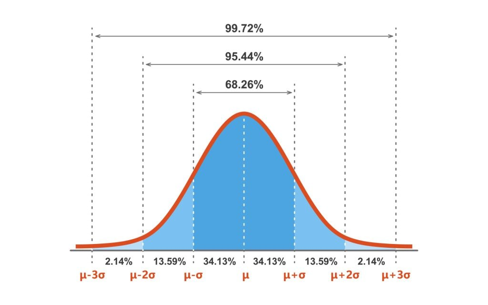

*Feature Scaling* is an important preprocessing step for many machine learning algorithms:

- to correctly calculate distance (in distance-based models such as **KNeighbors**)
- to correctly do dimensionality reduction algorithms like **PCA**
- to speed up convergence time (in **LogisticRegression** and **SGD**)
- to find a better fit model on **non-linear data** (normalization)

For illustrations, see: [Importance of Feature Scaling | Scikit-learn Docs](https://scikit-learn.org/stable/auto_examples/preprocessing/plot_scaling_importance.html).

**Feature scaling** puts variables that live on different scales onto a comparable scale.

Example: number of rooms might range from 1 to 10, while house area might range from 100 to 1000 square meters.

- We want the model to treat 10 rooms as “large” and 1000 sq m as “large” in their respective contexts, and similarly to treat 1 room and 100 sq m as “small.”
- We also do not want the model to effectively ignore the 1–10 range because those numbers are tiny compared to 100–1000.

## Types of Scaling

Scaling methods fall into **linear** and **nonlinear** categories.

### A. Linear scaling

These preserve the relative ordering and spacing of values (up to a linear transform).

Two common options:

#### A.1 Min-max scaling (0–1 range)

In the library ([`MinMaxScaler`](https://scikit-learn.org/stable/modules/generated/sklearn.preprocessing.MinMaxScaler.html)): map values from their original range to a fixed range, usually 0 to 1.

$$
x_\text{scaled} = \frac{x - x_\text{min}}{x_\text{max} - x_\text{min}}
$$

**Use when:** Data are roughly **uniform** over a bounded range.

#### A.2 Standard (z-score) scaling

In the library ([`StandardScaler`](https://scikit-learn.org/stable/modules/generated/sklearn.preprocessing.StandardScaler.html)): center values at zero (subtract the mean) and scale by standard deviation so values are in “standard units.”

The z-score $z$ for a value $x$ is:

$$
z = \frac{x - \mu}{s}
$$

where $\mu$ and $s$ are the mean and standard deviation of the training samples, respectively.

**Use when:** Data are **normally distributed** (or close to it).

**In practice:** We often ignore the exact distribution and apply standard scaling anyway [@scikit-learn.org]. Values beyond roughly ±3 standard deviations are typically treated as **outliers** and may be handled separately.

### B. Nonlinear scaling

These change the relative spacing between values. Examples:

#### B.1 Log scaling

Log scaling can turn skewed (non-normal) distributions into a more **symmetric**, approximately normal shape using the natural logarithm:

$$
x_\text{normalized} = \ln(x)
$$

As illustrated:

Useful for data that follow a **power-law distribution**: a few very large values and many smaller ones.

Examples:

**City Populations**:

- if you rank cities by population, the largest city is often about twice the second, and three times the third (Zipf’s law).
- In the US, New York City (~8.3 million) is roughly twice the size of Los Angeles (~3.8 million).

**Attention**:

- A few movies/books get, maybe, 90% of the attention; the rest 10% is distributed to the vast majority.

See [Transforming the target variable](https://scikit-learn.org/stable/auto_examples/compose/plot_transformed_target.html).

---
